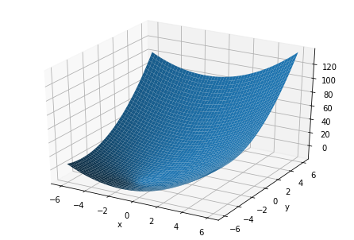
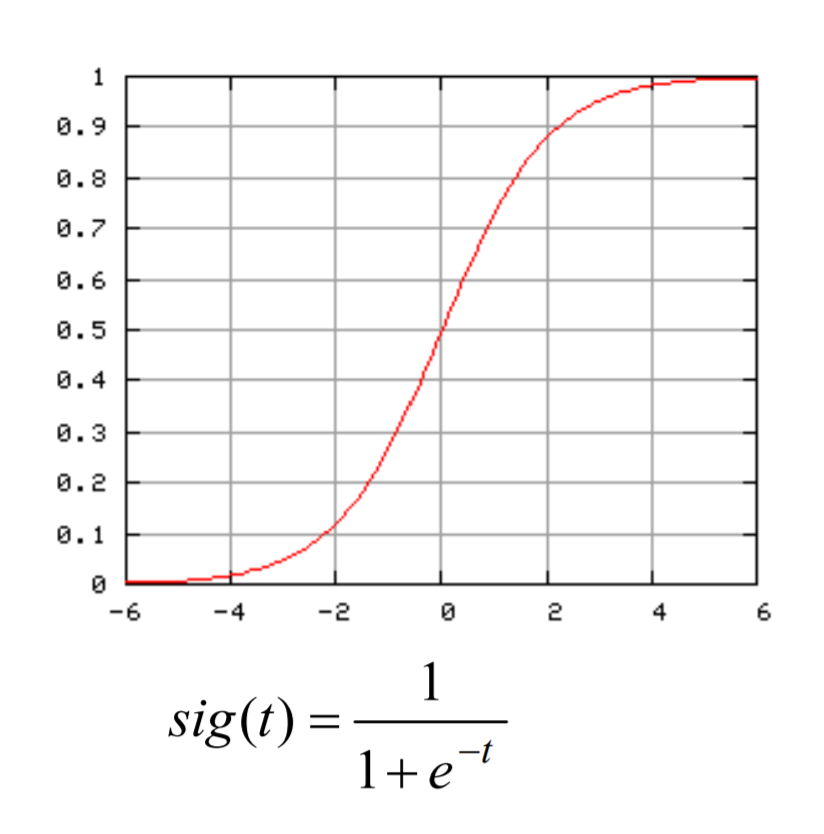
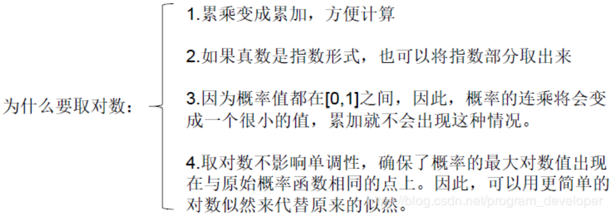
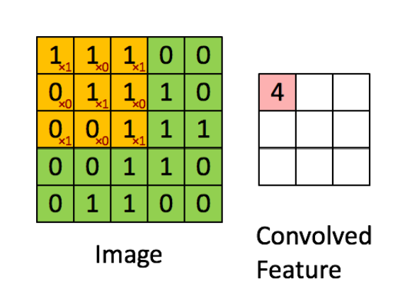

# AI  Learning Notes
@(Machine Learning)

[TOC]


## 第一阶段-笔记


### 环境搭建


#### 安装 python 环境
- python3 下载


#### 了解工具使用：anaconda、pip、Pycharm

- anaconda
- pip
- Pycharm


## 第二阶段-笔记


### 一，前言
- python 版本 Python2 Python3
- 从IDLE启动Python
- python --version
- >>> print('i love you')   __输出：i love you__
- >>> print(5 + 3)          __输出：8__
- >>> print('you '+ 'love'+ 'me') __输出： you love me__
- >>> print('i love you\n' * 3) __输出：  i love you 三行__


### 二，Python设计小游戏
- input 方法
- python 缩进和 冒号：
- BIF 内置函数 print() input() help()
- help() 用于显示BIF的功能描述
- dir(__builtins__) 可以看到Python提供的内置函数列表
     
```  
	'ArithmeticError', 
	'AssertionError', 
	'AttributeError', 
	'BaseException',
	'BlockingIOError', 
	'BrokenPipeError', 
	'BufferError',
	'BytesWarning',
	'ChildProcessError','ConnectionAbortedError', 'ConnectionError',、
	'ConnectionRefusedError', 'ConnectionResetError', 'DeprecationWarning', 
	'EOFError', 'Ellipsis', 'EnvironmentError', 'Exception', 
	'False', 'FileExistsError', 
	'FileNotFoundError', 'FloatingPointError',
	'FutureWarning', 'GeneratorExit', 'IOError', 'ImportError', 'ImportWarning','IndentationError', 'IndexError',
	'InterruptedError', 'IsADirectoryError', 'KeyError', 
	'KeyboardInterrupt', 'LookupError', 'MemoryError', 
	'ModuleNotFoundError', 'NameError', 'None', 'NotADirectoryError', 'NotImplemented', 'NotImplementedError', 'OSError', 'OverflowError',
	'PendingDeprecationWarning', 'PermissionError', 
	'ProcessLookupError', 'RecursionError', 'ReferenceError', 
	'ResourceWarning', 'RuntimeError', 'RuntimeWarning', 
	'StopAsyncIteration', 'StopIteration', 
	'SyntaxError', 'SyntaxWarning', 'SystemError', 'SystemExit', 'TabError', 'TimeoutError', 'True', 'TypeError', 
	'UnboundLocalError', 'UnicodeDecodeError', 
	'UnicodeEncodeError', 'UnicodeError', 'UnicodeTranslateError', 'UnicodeWarning', 'UserWarning', 'ValueError', 'Warning', 
	'ZeroDivisionError', '__build_class__', '__debug__', '__doc__', '__import__', '__loader__', '__name__', '__package__', '__spec__', 
	'abs', 'all', 'any', 'ascii', 'bin', 'bool', 
	'breakpoint', 'bytearray', 'bytes', 'callable', 
	'chr', 'classmethod', 'compile', 'complex', 
	'copyright', 'credits', 'delattr', 'dict', 'dir', 
	'divmod', 'enumerate', 'eval', 'exec', 'exit', 
	'filter', 'float', 'format', 'frozenset', 
	'getattr', 'globals', 'hasattr', 'hash', 
	'help', 'hex', 'id', 'input', 'int', 
	'isinstance', 'issubclass', 'iter', 'len', 
	'license', 'list', 'locals', 'map', 'max', 
	'memoryview', 'min', 'next', 'object', 'oct', 
	'open', 'ord', 'pow', 'print', 'property', 
	'quit', 'range', 'repr', 'reversed', 'round', 
	'set', 'setattr', 'slice', 'sorted', 'staticmethod', 
	'str', 'sum', 'super', 'tuple', 'type', 'vars', 'zip']
```


### 三，基础知识
1. 变量
   - 内存开辟的一块内存，用户存储变量，id,type,value
   - 变量可以重新赋值 teacher = 'sdl'
   - 字符串拼接 *'you' + 'me'*
   - 使用变量之前，需要对其赋值
   - 变量名命名规范
  	 - __包含字母，数字，下划线，但不能以数字开头__
  	 - __区分大小写__
	 - __命名专业些__
2. 字符串
   - 单引号或双引号 '' ""，成对出现，不能混用
   - 如果字符串中包含（'',""）,转义符 \ 用于转义 '' ""
   - 原始字符串 string = r"C:\now"
   - 无论是否原始字符串，都不能以\ 作为结尾

3. 长字符串
  - 使用三重 ('''内容''') 用于显示多行文字

4. 条件分支
  - 比较操作符 < <= > >= == !=
  - if: -- else: --
5. while 循环
  - while 条件：

6. 数据类型
  - 数值类型：整型，浮点型，布尔类型，复数类型等
  - 布尔类型 True,False
  - 类型转换： int() float() str()
  - 获取类型 type()  *type('520') 输出：<class 'str'>*
  - 获取类型 isinstance() *isinstance('str',str) 输出：True*

7. 常用操作符
  - 算数运算符 + - * / % ** //
  - 优先级问题
  - 比较操作符 < <= > >= == != 
  - 逻辑操作符 and  or not 
  
  
  
### 四，分支 循环

1. 条件分支
  - if: 
  - if:  else: 
  - if:  elif:  else:
  
2. 三元操作符
  - samll = x if x <y else y
  
3. 断言
  - assert 当这个关键字之后的条件为假时，程序自动崩溃并抛出AssertionException

4. while 循环
  -  while 条件： 循环体

5. for 循环
  - for each in 'hello': print(each)
  - range()内建函数 整型列表 for i in range(1,100,2)

6. break 语句
  - 作用：终止当前循环，调出循环体
 
7. continue 语句
  - 作用：终止本轮循环并开始下一轮循环
   


### 五，列表 元组 字符串
- 备注：
  Python中的变量没有数据类型
  
#### 1. 列表
1. 创建列表
  - list  = [1,2,3,'string',(1,3),"i love you."] *备注：列表中包含各种类型数据类型*
  - empty = []
  - name  = ['张三','李四','王五','赵六']
  
2. 添加元素
  - append()   *例如：number.append(5)，只能一次添加一个元素*
  - extend()   *例如：number.extend([7,8]) 一次可以添加多个元素*
  - insert()   *例如：number.insert(1,0) 索引值，值*

3. 获取元素
  - 通过索引值获取单个元素，注意索引值从0开始
  - name[0]
  - name[1],name[3] = name[3],name[1] *互换位置*
  
4. 删除元素
  - remove()
  - pop()      *默认弹出最后一个元素* pop(index) *index 索引值*
  - del
  
5. 列表分片
  - name[0:2]   *输出：[张三，李四]*
  - name[0:] 
  - name[:3]
  - name[:]
  
6. 列表分片进阶
  - 可以包含步长
  - 步长可以为负 name[::-1]
  
7. 列表的操作
  - 比大小 >
  - 拼接 +    *name2 = name + name*  
  - 复制 * 
  - not in， in 判断元素是否在列表中
  
8. 列表中方法

  ```
	'__add__', '__class__', '__contains__', '__delattr__', '__delitem__', 
	'__dir__',     '__doc__', '__eq__', '__format__', '__ge__', 
	'__getattribute__',   '__getitem__', '__gt__', '__hash__', 
	'__iadd__', '__imul__', '__init__', '__init_subclass__', 
	'__iter__', '__le__', '__len__', '__lt__', '__mul__', 
	'__ne__', '__new__', '__reduce__', '__reduce_ex__', '__repr__', 
	'__reversed__', '__rmul__', '__setattr__', '__setitem__', 
	'__sizeof__', '__str__', '__subclasshook__', 
	 - 'append', 'clear', 'copy', 'count', 'extend', 'index', 
	 'insert', 'pop', 'remove', 'reverse', 'sort'
  ```
 - index()
 - count()
 - copy()   _列表浅复制_ *真正的拷贝要使用 分片* 
 - reverse  *列表反转*
 - sort()   *排序* 
 

#### 2.元组
- 备注：
  不可变对象，元组与列表的最大区别在于元组不可以任意修改
 
1. 创建元组
  - tuple = ()
  - tuple1 = (1,2,3,4,5)
  
2. 访问元组
  - tuple1[1]
  - tuple1[1:]
  - tuple1[:]
  - t = (3,) *必须包含一个逗号*
 
3. 更新和删除元组
  - 拼接 +
  - del 删除整个元组


#### 3.字符串
1. 字符串操作
  - str = 'hello world.' *str = "hello world."* 单引号，双引号
  - 字符串为不可修改对象
  - 其他操作与列表，元组类似
  - 比较操作符，逻辑操作符，成员关系操作符 跟元组和列表一样

2. 字符串的常见内置函数
  - S.lower() 
    S.upper()
    S.title()
    S.swapcase()
	S.isdigit()
	S.center(width[, fillchar])
	S.find(sub[, start[, end]])
3. 格式化
  - format() *位置参数 {a} love {b}.format(a='I',b = 'YOU')*
  - 关键字参数
  - 格式化操作符 % *print("I'm %s. I'm %d year old" % ('Hom', 30))*
  - 格式 描述
	%% 百分号标记 #就是输出一个%
	%c 字符及其ASCII码
	%s 字符串
	%d 有符号整数(十进制)
	%u 无符号整数(十进制)
	%o 无符号整数(八进制)
	%x 无符号整数(十六进制)
	%X 无符号整数(十六进制大写字符)
	%e 浮点数字(科学计数法)
	%E 浮点数字(科学计数法，用E代替e)
	%f 浮点数字(用小数点符号)
	%g 浮点数字(根据值的大小采用%e或%f)
	%G 浮点数字(类似于%g)
	%p 指针(用十六进制打印值的内存地址)
	%n 存储输出字符的数量放进参数列表的下一个变量中
4. python 转义符
  - \(在行尾时)	续行符
  - \\	 反斜杠符号
  -	\’	 单引号
  - \”	 双引号
  - \a	 响铃
  - \b	 退格(Backspace)
  - \e	 转义
  - \000 空
  - \n	 换行
  - \v	 纵向制表符
  - \t	 横向制表符
  - \r	 回车
  - \f	 换页
  - \oyy	八进制数yy代表的字符，例如：\o12代表换行
  - \xyy	十进制数yy代表的字符，例如：\x0a代表换行
  - \other	其它的字符以普通格式输出

#### 4.序列　　

1. 序列特性
  - 都可以通过索引获取到每一个元素
  - 默认索引从0开始，支持负数索引
  - 可以通过分片获取一定范围内的元素的集合
  - 有很多共同的操作符

2. 常见函数
  - list()
  - tuple 
  - str()
  - len()
  - max()
  - min()
  - sum()
  - sorted() *sorted(iteable, key=None, reverse=False)*
  - reversed(sequence)
  - enumerater(iterate) 
  - zip(iter1[]) *共同组成的元组*

 
### 六，函数
-  python的乐高积木： 函数，对象，模块

1. 函数创建和调用
  - def fun(): print('Hello world！')
  - 调用函数： fun() __输出： Hello world! __
  
2. 函数的参数
  - def add(num1,num2): print(num1 + num2)
  - num1,num2 就是函数的参数

3. 函数的还回值
  - return 关键字

4. 参数
  - 形式参数(形参)，实际参数（实参）
  - 函数的文档：描述该函数的功能 
     - help(fun) 内部使用： """这是函数的功能描述"""
     - __doc__也可以查看函数的功能描述
  - 位置参数：按照默认的参数顺序
  - 关键字参数 fun(name='sdl',age=29)
  - 默认参数：在定义的时候赋予了形式参数的默认值
  - 收集参数（可变参数）def fun(* params) 
 	 - *   既可以打包也可以解包，元组
	 - **  既可以打包也可以解包，字典


5. 函数和过程
  - 函数是有还回值的，而过程是简单，特殊并且没有还回值

6. 函数变量的作用域
  - 局部变量，在函数内部定义的参数以及变量，都称为局部变量，出了这个函数，这些变量是无效的，随函数执行结束，自动删除
  - 全局变量，函数外定义的变量是全局变量
  - global 关键字 用户指定全局变量
  
7. 内嵌函数
  - 允许函数内部创建另一个函数，叫做内嵌函数或者内部函数
  - 内部函数的整个作用域在外部函数之内
  - 闭包
     - 在一个内部函数里，对在外部函数作用域的变量进行引用，那么内部函数就被认为闭包
     - nonlocal 关键字
     
8. lambda 表达式
   - def ds(x): return 2 * x +1 
   - 等价于 lambda x: 2 * x + 1 
   - def add(a,b): return a + b
   - 等价于 lambda a,b: a + b
   - lambda 的作用：
      - 使代码更简洁
      - 匿名函数
   - filter()函数 过滤器
   - map()
   
9. 递归
   - 汉诺塔游戏
   - 求阶乘
   - 幂运算
   - 求回文字
   - 谢尔宾斯基三角形
   - 斐波那契数列
     

### 七，字典 集合

#### 1.字典
 - 备注： hash 映射

1. 字典创建
  - dict1 = {} *{} 直接使用大括号*
  - dict1 = {'name':'sdl'}
  - dict1 - dict((('name','sdl'),('age',29)))
  - dict1['add'] = '上海市'
2. 字典的内置方法
  - fromkeys()
  - keys()
  - values()
  - items()
  - get() *当键值不存在的，还回None,也可以指定默认还回值 例如：dict1.get('ss','没有')*
  - clear()  *清空一个字典* a = {} *会存在问题*
  - copy()   *复制字典*
  - pop()    *弹出给定键对应的值*
  - popitem()
  - setdefault() *类似get()*
  - update() *更新字典*
  - 收集参数其实有两种打包方式： * 表示以元组方式打包， ** 以字典的形式打包
  
#### 2.集合
- 备注： {}表示 {1,2,3} 无键值对

1. 创建集合
  - set1 = {1,2,3,4,5}  
  - set1 = set(['1','2','3'])

2. 访问集合
  - 集合是无序的，无法根据索引获取元素
  - in, not in 判断元素是否在集合中
  - add() 添加元素
  - remove() 删除集合中的元素
3. 不可变集合
  - frozenset()函数 可以像元组一样不能修改


### 八，永久存储
1. 文件操作
  - 打开文件 
  - open(name[, mode[, buffering]],encoding = None,errors = None,newline = None, closefd =True, opener = None)
  - <a href="https://docs.python.org/3.7/library/functions.html#open">docs </a>
  - 打开模式
    
  ```
  	不同模式打开文件的完全列表：
	模式	描述
	r	以只读方式打开文件。文件的指针将会放在文件的开头。这是默认模式。
	rb	以二进制格式打开一个文件用于只读。文件指针将会放在文件的开头。这是默认模式。
	r+	打开一个文件用于读写。文件指针将会放在文件的开头。
	rb+	以二进制格式打开一个文件用于读写。文件指针将会放在文件的开头。
	w	打开一个文件只用于写入。如果该文件已存在则打开文件，并从开头开始编辑，即原有内容会被删除。如果该文件不存在，创建新文件。
	wb	以二进制格式打开一个文件只用于写入。如果该文件已存在则打开文件，并从开头开始编辑，即原有内容会被删除。如果该文件不存在，创建新文件。
	w+	打开一个文件用于读写。如果该文件已存在则打开文件，并从开头开始编辑，即原有内容会被删除。如果该文件不存在，创建新文件。
	wb+	以二进制格式打开一个文件用于读写。如果该文件已存在则打开文件，并从开头开始编辑，即原有内容会被删除。如果该文件不存在，创建新文件。
	a	打开一个文件用于追加。如果该文件已存在，文件指针将会放在文件的结尾。也就是说，新的内容将会被写入到已有内容之后。如果该文件不存在，创建新文件进行写入。
	ab	以二进制格式打开一个文件用于追加。如果该文件已存在，文件指针将会放在文件的结尾。也就是说，新的内容将会被写入到已有内容之后。如果该文件不存在，创建新文件进行写入。
	a+	打开一个文件用于读写。如果该文件已存在，文件指针将会放在文件的结尾。文件打开时会是追加模式。如果该文件不存在，创建新文件用于读写。
	ab+	以二进制格式打开一个文件用于追加。如果该文件已存在，文件指针将会放在文件的结尾。如果该文件不存在，创建新文件用于读写。
  ```
  - 文件对象的方法
  
  ```
  	file 对象方法
	file.read([size])：size 未指定则返回整个文件，如果文件大小 >2 倍内存则有问题，f.read()读到文件尾时返回""(空字串)。
	file.readline()：返回一行。
	file.readlines([size]) ：返回包含size行的列表, size 未指定则返回全部行。
	for line in f: print line ：通过迭代器访问。
	f.write("hello\n")：如果要写入字符串以外的数据,先将他转换为字符串。
	f.tell()：返回一个整数,表示当前文件指针的位置(就是到文件头的比特数)。
	f.seek(偏移量,[起始位置])：用来移动文件指针。
	偏移量: 单位为比特，可正可负
	起始位置: 0 - 文件头, 默认值; 1 - 当前位置; 2 - 文件尾
	f.close() 关闭文件
  ```
  
  - 文件的关闭
     - close()    __with 用于替换close()__
  - 文件的读取和定位
     - read()
     - tell()
     - seek()
     - readline()
     - readlines()
     - list()
  - 文件的写入
     - write()

2. 文件系统
  - import os
  - os 模块中关于文件操作   
  
  ```
	os模块中关于文件/目录常用的函数使用方法os.path模块中关于路径常用的函数使用方法
	函数名   使用方法
	getcwd()  返回当前工作目录
	chdir(path) 改变工作目录
	listdir(path='.') 列举指定目录中的文件名（'.'表示当前目录，'..'表示上一级目录）
	mkdir(path) 创建单层目录，如该目录已存在抛出异常
	makedirs(path) 递归创建多层目录，如该目录已存在抛出异常，注意：'E:\\a\\b'和'E:\\a\\c'并不会冲突
	remove(path) 删除文件
	rmdir(path) 删除单层目录，如该目录非空则抛出异常
	removedirs(path) 递归删除目录，从子目录到父目录逐层尝试删除，遇到目录非空则抛出异常
	rename(old, new) 将文件old重命名为new
	system(command) 运行系统的shell命令
	walk(top) 遍历top路径以下所有的子目录，返回一个三元组：(路径, [包含目录], [包含文件])
		
	以下是支持路径操作中常用到的一些定义，支持所有平台
	os.curdir 指代当前目录（'.'）
	os.pardir 指代上一级目录（'..'）
	os.sep 输出操作系统特定的路径分隔符（Win下为'\\'，Linux下为'/'）
	os.linesep 当前平台使用的行终止符（Win下为'\r\n'，Linux下为'\n'）
	os.name 指代当前使用的操作系统（包括：'posix',  'nt', 'mac', 'os2', 'ce', 'java'）
	
	函数名 使用方法
    basename(path) 去掉目录路径，单独返回文件名
	dirname(path) 去掉文件名，单独返回目录路径
	join(path1[, path2[, ...]]) 将path1, path2各部分组合成一个路径名
	split(path) 分割文件名与路径，返回(f_path, f_name)元组。如果完全使用目录，它也会将最后一个目录作为文件名分离，且不会判断文件或者目录是否存在
	splitext(path) 分离文件名与扩展名，返回(f_name, f_extension)元组
	getsize(file) 返回指定文件的尺寸，单位是字节
	getatime(file) 返回指定文件最近的访问时间（浮点型秒数，可用time模块的gmtime()或localtime()函数换算）
	getctime(file) 返回指定文件的创建时间（浮点型秒数，可用time模块的gmtime()或localtime()函数换算）
	getmtime(file) 返回指定文件最新的修改时间（浮点型秒数，可用time模块的gmtime()或localtime()函数换算）
	
	以下为函数返回 True 或 False
    exists(path) 判断指定路径（目录或文件）是否存在
	isabs(path) 判断指定路径是否为绝对路径
	isdir(path) 判断指定路径是否存在且是一个目录
	isfile(path) 判断指定路径是否存在且是一个文件
	islink(path) 判断指定路径是否存在且是一个符号链接
	ismount(path) 判断指定路径是否存在且是一个挂载点
	samefile(path1, paht2) 判断path1和path2两个路径是否指向同一个文件
  ```
  
3. pickle
  - <a href="https://www.cnblogs.com/lincappu/p/8296078.html">pickle模块的使用 </a>
  - pickle 模块可以把所有Python的对象都转化为二进制的形式存放
  - pickling 
  - unpickling 
         
  


### 九，异常处理

1. 异常种类  

 ``` 
 BaseException
 +-- SystemExit
 +-- KeyboardInterrupt
 +-- GeneratorExit
 +-- Exception
      +-- StopIteration
      +-- StandardError
      |    +-- BufferError
      |    +-- ArithmeticError
      |    |    +-- FloatingPointError
      |    |    +-- OverflowError
      |    |    +-- ZeroDivisionError  除数为零
      |    +-- AssertionError    断言语句（assert）失败
      |    +-- AttributeError    尝试访问未知的对象属性
      |    +-- EnvironmentError
      |    |    +-- IOError
      |    |    +-- OSError      操作系统产生的异常
      |    |         +-- WindowsError (Windows)
      |    |         +-- VMSError (VMS)
      |    +-- EOFError
      |    +-- ImportError
      |    +-- LookupError
      |    |    +-- IndexError   索引超出序列的范围
      |    |    +-- KeyError     字典中查找到一个不存在的关键字
      |    +-- MemoryError
      |    +-- NameError         尝试访问一个不存在的关键字
      |    |    +-- UnboundLocalError
      |    +-- ReferenceError
      |    +-- RuntimeError
      |    |    +-- NotImplementedError
      |    +-- SyntaxError       Python的语法错误
      |    |    +-- IndentationError
      |    |         +-- TabError
      |    +-- SystemError
      |    +-- TypeError         不同类型间的无效操作
      |    +-- ValueError
      |         +-- UnicodeError
      |              +-- UnicodeDecodeError
      |              +-- UnicodeEncodeError
      |              +-- UnicodeTranslateError
      +-- Warning
           +-- DeprecationWarning
           +-- PendingDeprecationWarning
           +-- RuntimeWarning
           +-- SyntaxWarning
           +-- UserWarning
           +-- FutureWarning
       +-- ImportWarning
       +-- UnicodeWarning
       +-- BytesWarning
  ```
2. try-except 语句
  - 单个处理  
  
  ```
  try: 
     检测范围
    
  except Exception(as reason):
     出现异常后的处理代码
  ```
  
  - 多个处理
  
  ```
  try: 
     检测范围
    
  except OSError as reason:
     出现异常后的处理代码
  except TypeError as reason:
     出现异常后的处理代码  
  ``` 
  -  多个异常统一处理
  
  ```
  try: 
     检测范围
    
  except (OSError,TypeError):
     出现异常后的处理代码 
  ```
  
  - 捕获所有异常
  
  ```
  try: 
     检测范围
    
  except:
     出现异常后的处理代码 
  ```
3. try-finally 语句
  - finally 关键字
  
  
  ```
  try: 
     检测范围
    
  except:
     出现异常后的处理代码 
     
  finally:
     收尾工作   
  ``` 
  
4. rsise 语句
  - 抛出异常
  
5. else 语句
  - if-else
  - try-except-else
  - while-else
  
6. with 语句
  - 用于文件操作，解决忘记关闭文件的操作 
   
  
  
### 十，类和对象

1. 对象 Class
  - 对象 = 属性 + 方法
  - 类的实例化 cls = Class()
  - 方法参数 self
  
2. 魔法方法 详见：十二章：魔法方法
  - 双下划线包围的方法
  - 对象在不同阶段被自动调用

3. 公有和私有：
   - 私有变量只需要在在变量名或参数名前加双下划线 __
   - python 目前所有的私有机制是伪私有的
   
4. 继承
   - class 类名(被继承的类)：
   - 基类，父类，超类，
   - 子类，一个子类可以继承它的父类的任何属性和方法
   - 子列会自动覆盖父类对应的父类的方法或属性
   - 调用未绑定的父类方法 父类.__ init __(self)
   - 使用super()    super().__ init __()

5. 多继承
   - class 类名(父类1， 父类2，父类3，...):
   - 同时继承多个父类的属性和方法

6. 组合

7. 类 类对象 实例对象
  - 类中的定义的属性是静态变量
 
8. 绑定
  - __ dict __ 仅有实例对象的属性
  
9. 一些内置函数 BIF
  - 类和对象的一些内置函数
  - issunclass()
  - isinstance()
  - hasattr()
  - getattr()
  - setattr()
  - delattr()
  - property()
  - <a href="https://www.cnblogs.com/Yanjy-OnlyOne/p/10041951.html" target="_blank">python类与对象的内置函数大全（BIF)</a>

### 十一，魔法方法

1. 魔法方法
  - <a href="https://www.cnblogs.com/liqianglog/p/11151877.html" target="_blank">魔法方法详解</a>
  - <a href="https://www.cnblogs.com/seablog/p/7173107.html" target="_blank">魔法方法详解2</a>
  
  ```
   魔法方法
		含义  基本的魔法方法
		__new__(cls[, ...])	1. __new__ 是在一个对象实例化的时候所调用的第一个方法
		2. 它的第一个参数是这个类，其他的参数是用来直接传递给 __init__ 方法
		3. __new__ 决定是否要使用该 __init__ 方法，因为 __new__ 可以调用其他类的构造方法或者直接返回别的实例对象来作为本类的实例，如果 __new__ 没有返回实例对象，则 __init__ 不会被调用
		4. __new__ 主要是用于继承一个不可变的类型比如一个 tuple 或者 string
		__init__(self[, ...])	构造器，当一个实例被创建的时候调用的初始化方法
		__del__(self)	析构器，当一个实例被销毁的时候调用的方法
		__call__(self[, args...])	允许一个类的实例像函数一样被调用：x(a, b) 调用 x.__call__(a, b)
		__len__(self)	定义当被 len() 调用时的行为
		__repr__(self)	定义当被 repr() 调用时的行为
		__str__(self)	定义当被 str() 调用时的行为
		__bytes__(self)	定义当被 bytes() 调用时的行为
		__hash__(self)	定义当被 hash() 调用时的行为
		__bool__(self)	定义当被 bool() 调用时的行为，应该返回 True 或 False
		__format__(self, format_spec)	定义当被 format() 调用时的行为
		 	有关属性
		__getattr__(self, name)	定义当用户试图获取一个不存在的属性时的行为
		__getattribute__(self, name)	定义当该类的属性被访问时的行为
		__setattr__(self, name, value)	定义当一个属性被设置时的行为
		__delattr__(self, name)	定义当一个属性被删除时的行为
		__dir__(self)	定义当 dir() 被调用时的行为
		__get__(self, instance, owner)	定义当描述符的值被取得时的行为
		__set__(self, instance, value)	定义当描述符的值被改变时的行为
		__delete__(self, instance)	定义当描述符的值被删除时的行为
		 	比较操作符
		__lt__(self, other)	定义小于号的行为：x < y 调用 x.__lt__(y)
		__le__(self, other)	定义小于等于号的行为：x <= y 调用 x.__le__(y)
		__eq__(self, other)	定义等于号的行为：x == y 调用 x.__eq__(y)
		__ne__(self, other)	定义不等号的行为：x != y 调用 x.__ne__(y)
		__gt__(self, other)	定义大于号的行为：x > y 调用 x.__gt__(y)
		__ge__(self, other)	定义大于等于号的行为：x >= y 调用 x.__ge__(y)
		 	算数运算符
		__add__(self, other)	定义加法的行为：+
		__sub__(self, other)	定义减法的行为：-
		__mul__(self, other)	定义乘法的行为：*
		__truediv__(self, other)	定义真除法的行为：/
		__floordiv__(self, other)	定义整数除法的行为：//
		__mod__(self, other)	定义取模算法的行为：%
		__divmod__(self, other)	定义当被 divmod() 调用时的行为
		__pow__(self, other[, modulo])	定义当被 power() 调用或 ** 运算时的行为
		__lshift__(self, other)	定义按位左移位的行为：<<
		__rshift__(self, other)	定义按位右移位的行为：>>
		__and__(self, other)	定义按位与操作的行为：&
		__xor__(self, other)	定义按位异或操作的行为：^
		__or__(self, other)	定义按位或操作的行为：|
		 	反运算
		__radd__(self, other)	（与上方相同，当左操作数不支持相应的操作时被调用）
		__rsub__(self, other)	（与上方相同，当左操作数不支持相应的操作时被调用）
		__rmul__(self, other)	（与上方相同，当左操作数不支持相应的操作时被调用）
		__rtruediv__(self, other)	（与上方相同，当左操作数不支持相应的操作时被调用）
		__rfloordiv__(self, other)	（与上方相同，当左操作数不支持相应的操作时被调用）
		__rmod__(self, other)	（与上方相同，当左操作数不支持相应的操作时被调用）
		__rdivmod__(self, other)	（与上方相同，当左操作数不支持相应的操作时被调用）
		__rpow__(self, other)	（与上方相同，当左操作数不支持相应的操作时被调用）
		__rlshift__(self, other)	（与上方相同，当左操作数不支持相应的操作时被调用）
		__rrshift__(self, other)	（与上方相同，当左操作数不支持相应的操作时被调用）
		__rxor__(self, other)	（与上方相同，当左操作数不支持相应的操作时被调用）
		__ror__(self, other)	（与上方相同，当左操作数不支持相应的操作时被调用）
		 	增量赋值运算
		__iadd__(self, other)	定义赋值加法的行为：+=
		__isub__(self, other)	定义赋值减法的行为：-=
		__imul__(self, other)	定义赋值乘法的行为：*=
		__itruediv__(self, other)	定义赋值真除法的行为：/=
		__ifloordiv__(self, other)	定义赋值整数除法的行为：//=
		__imod__(self, other)	定义赋值取模算法的行为：%=
		__ipow__(self, other[, modulo])	定义赋值幂运算的行为：**=
		__ilshift__(self, other)	定义赋值按位左移位的行为：<<=
		__irshift__(self, other)	定义赋值按位右移位的行为：>>=
		__iand__(self, other)	定义赋值按位与操作的行为：&=
		__ixor__(self, other)	定义赋值按位异或操作的行为：^=
		__ior__(self, other)	定义赋值按位或操作的行为：|=
		 	一元操作符
		__neg__(self)	定义正号的行为：+x
		__pos__(self)	定义负号的行为：-x
		__abs__(self)	定义当被 abs() 调用时的行为
		__invert__(self)	定义按位求反的行为：~x
		 	类型转换
		__complex__(self)	定义当被 complex() 调用时的行为（需要返回恰当的值）
		__int__(self)	定义当被 int() 调用时的行为（需要返回恰当的值）
		__float__(self)	定义当被 float() 调用时的行为（需要返回恰当的值）
		__round__(self[, n])	定义当被 round() 调用时的行为（需要返回恰当的值）
		__index__(self)	1. 当对象是被应用在切片表达式中时，实现整形强制转换
		2. 如果你定义了一个可能在切片时用到的定制的数值型,你应该定义 __index__
		3. 如果 __index__ 被定义，则 __int__ 也需要被定义，且返回相同的值
		 	上下文管理（with 语句）
		__enter__(self)	1. 定义当使用 with 语句时的初始化行为
		2. __enter__ 的返回值被 with 语句的目标或者 as 后的名字绑定
		__exit__(self, exc_type, exc_value, traceback)	1. 定义当一个代码块被执行或者终止后上下文管理器应该做什么
		2. 一般被用来处理异常，清除工作或者做一些代码块执行完毕之后的日常工作
		 	容器类型
		__len__(self)	定义当被 len() 调用时的行为（返回容器中元素的个数）
		__getitem__(self, key)	定义获取容器中指定元素的行为，相当于 self[key]
		__setitem__(self, key, value)	定义设置容器中指定元素的行为，相当于 self[key] = value
		__delitem__(self, key)	定义删除容器中指定元素的行为，相当于 del self[key]
		__iter__(self)	定义当迭代容器中的元素的行为
		__reversed__(self)	定义当被 reversed() 调用时的行为
		__contains__(self, item)	定义当使用成员测试运算符（in 或 not in）时的行为
   ```


### 十二，模块

- 备注： 模块是一种更高级的封装
- 容器，例如列表，元组，字符串，字典等，这些是对数据的封装
- 函数，是对语句的封装
- 类，是对方法和属性的封装，也就是对函数和数据的封装
- 模块，就是程序 以 .py结尾的文件吧，都是一个独立的模块
- import 导入模块

1. 命名空间
  - 每一个模块都有一个独立的命名空间


2. 导入模块
  - import
  - from p import p1
  
3. '__name__' == '__main__'

4. 搜索路径

5. 包
  - 存放相关模块的文件夹
  - __init__.py 的模块文件
  - 将相关的模块放到文件夹里
  
6. 极客思考
  - python 标准库
  - Python docs
  - dir()  *可以查到该模块定义哪些变量，函数和类*
  - help()
  
  ```
   'Timer', '__all__', '__builtins__', '__cached__', 
   '__doc__', '__file__', '__loader__',  '__name__', 
   '__package__', '__spec__', '_globals', 
   'default_number', 'default_repeat', 
   'default_timer', 'dummy_src_name', 'gc', 
   'itertools', 'main', 'reindent', 'repeat', 
   'sys', 'template', 'time', 'timeit']
  ```
  
 

 


## 第三阶段-笔记


### 一元方程

```python
def f(x):
    return x ** 2 + 4*x + 1

def df(x):
    return 2 * x + 4

x_old = 3.14

for itr in range(20):
    x_new = x_old -  0.1 * df(x_old)
    x_old = x_new
    print("f({})={}".format(x_new,f(x_new)))
import numpy as np
import matplotlib.pyplot as plt

x = np.linspace(-6,3)
plt.plot(x,f(x))
plt.show()


```

    f(2.112)=13.908544000000001
    f(1.2896)=7.82146816
    f(0.63168)=3.9257396224
    f(0.105344)=1.4324733583359999
    f(-0.3157248)=-0.16321705066496017
    f(-0.65257984)=-1.1844589124255744
    f(-0.9220638720000001)=-1.838053703952368
    f(-1.1376510976)=-2.2563543705295155
    f(-1.31012087808)=-2.5240667971388895
    f(-1.448096702464)=-2.6954027501688893
    f(-1.5584773619712)=-2.805057760108089
    f(-1.64678188957696)=-2.8752369664691773
    f(-1.717425511661568)=-2.920151658540273
    f(-1.7739404093292543)=-2.948897061465775
    f(-1.8191523274634034)=-2.9672941193380957
    f(-1.8553218619707228)=-2.9790682363763814
    f(-1.8842574895765782)=-2.986603671280884
    f(-1.9074059916612627)=-2.9914263496197657
    f(-1.9259247933290102)=-2.99451286375665
    f(-1.940739834663208)=-2.996488232804256


### 二元方程
```python
def f_2d(x,y):
    return x ** 2 + 4*x + y ** 2 + 4*y + 1

def df_2d(x,y):
    return 2 * x + 4, 2 * y +4

x,y = 4,4
for itr in range(20):
    v_x,v_y = df_2d(x,y)
    x, y = x - 0.1 * v_x, y - 0.1 * v_y
    print("f({}{})={}".format(x,y,f_2d(x,y)))


from mpl_toolkits.mplot3d import Axes3D
import numpy as np
import matplotlib.pyplot as plt

x = np.linspace(-6,3)
y = np.linspace(-6,3)

X,Y = np.meshgrid(x,y)
fig = plt.figure()
ax = Axes3D(fig)
surf = ax.plot_surface(X, Y, f_2d(X,Y),rstride=1, cstride=1, cmap='rainbow')
plt.xlabel('x')
plt.ylabel('y')

plt.show()

```

    f(2.82.8)=39.08
    f(1.83999999999999991.8399999999999999)=22.4912
    f(1.07199999999999981.0719999999999998)=11.874367999999999
    f(0.45759999999999980.4575999999999998)=5.079595519999998
    f(-0.03392000000000017-0.03392000000000017)=0.7309411327999986
    f(-0.4271360000000002-0.4271360000000002)=-2.052197675008001
    f(-0.7417088000000002-0.7417088000000002)=-3.833406512005121
    f(-0.9933670400000001-0.9933670400000001)=-4.973380167683278
    f(-1.1946936320000001-1.1946936320000001)=-5.702963307317297
    f(-1.3557549056-1.3557549056)=-6.16989651668307
    f(-1.48460392448-1.48460392448)=-6.468733770677165
    f(-1.587683139584-1.587683139584)=-6.659989613233385
    f(-1.6701465116672-1.6701465116672)=-6.7823933524693665
    f(-1.73611720933376-1.73611720933376)=-6.860731745580395
    f(-1.788893767467008-1.788893767467008)=-6.9108683171714524
    f(-1.8311150139736063-1.8311150139736063)=-6.94295572298973
    f(-1.8648920111788851-1.8648920111788851)=-6.963491662713427
    f(-1.8919136089431081-1.8919136089431081)=-6.9766346641365935
    f(-1.9135308871544865-1.9135308871544865)=-6.98504618504742
    f(-1.930824709723589-1.930824709723589)=-6.990429558430349


### 练习
```python
from mpl_toolkits.mplot3d import Axes3D
import numpy as np
import matplotlib.pyplot as plt

def f_2d(x,y):
    return x ** 2 + 3 * x + y ** 2 + 8 * y + 1


def df_2d(x,y):
    return 2 * x + 3, 2 * y + 8

x,y = 4,4
for itr in range(200):
    v_x,v_y = df_2d(x,y)
    x, y = x - 0.1 * v_x, y - 0.1 * v_y
    # print("f({}{})={}".format(x,y,f_2d(x,y)))
    

x = np.linspace(-6,6)
y = np.linspace(-6,6)

X,Y = np.meshgrid(x,y)
fig = plt.figure()
ax = Axes3D(fig)
surf = ax.plot_surface(X, Y, f_2d(X,Y),rstride=1, cstride=1)
plt.xlabel('x')
plt.ylabel('y')

plt.show()
    


```



## 第四阶段-笔记


### 人工智能

#### 关系
 > 人工智能 --> 机器学习 --> 深度学习


#### 历史


#### 分支


#### 知识框架


### AI 概念

#### 模式识别
>  **样本（sample）**，要研究对象的一个个体，注意与统计学中的不同，类似于统计学中的实例（instance）；
>  
> **样本集（sample set）**，样本的集合，统计学中的样本就是指样本集；
> 
> **类或类别（class）**，在所有样本上定义的一个子集，处于同一类的样本，我们说她们具有相同的模式；习惯性地，我们用w1，w2等来表示类别，两类问题中也会用{0,1}或{-1,1}；

> **特征（feature）**，表征样本的特点或性状的量化集合，通常是数值表示（对于非数值形式，要转化为数值特征），也被称作为属性，如果是多个特征，就组成了特征向量（feature vector）。样本的特征构成了样本特征空间，空间的维数就是特征的个数，每一个样本就是特征空间中的一个点。

> **已知样本（known sample）**，已经事先知道类别的样本；

> **未知样本（unknown sample）**，类别标签未知但特征已知的样本；


**预测任务**
> 

**推荐算法**
> 

**分布式**
> 

**容错性**
> 

**协同过滤**
> 协同过滤是目前应用最广泛的推荐算法，它仅仅通过了解用户与物品之间的关系进行推荐，而根本不会考虑到物品本身的属性。
可分成两类：
1、基于用户（user-based）的协同过滤
2、基于商品（item-based）的协同过滤

**聚类（Clustering）**
> 聚类算法让机器组的数据点或项目分成具有相似特征的组。

**决策树（Decision tree）**
> 用于映射决策及其可能结果的树和分支模型，类似于流程图。

**有监督学习（Supervised learning）**
> 机器学习类型的一种，输出数据集训练机器生成所需的算法，像一个教师监督学生，比无监督学习更常见。

**无监督学习（Unsupervised learning**
> 一种机器学习算法，用于从不带标记响应的包含输入数据的数据集中提取结果。最常见的无监督学习方法是聚类分析。

**自然语言处理（Natural language processing）**
> 程序在理解的基础上识别人类交流的能力。

**强化学习(Reinforcement Learning)**
> 是一种比较复杂的机器学习种类， 强调的是系统与外界不断地交互，获得外界的反馈，然后决定自身的行为。

**获取数据与特征工程**
> 数据集
> 训练集
> 测试集
> 验证集
> 离散和连续数据
> 特征 特征向量 样本 类标签
> 递归 迭代 并行
> 字段
> PCA 降维
> 分布 主题分布 长尾分布
> 矢量 标量
> 多项式

**获取数据**
> 归一化
> 人工标注
> 特征选取
> 正负样本
> 类别集合
> 序列 向量序列
> 自变量 因变量
> 采样

**数据处理**
> 分词 分词器
> 高维数据投影到低维空间
> 特征提取
> 近似

**模型一**
> 模型 参数
> 训练 预测 分类 回归 聚类 
> 目标函数 损失函数
> 属性集 目标属性
> 梯度 步长
> 全局最优解 局部最优解 
> 准确度 误差 逼近
> 训练速度 解空间搜索

**模型二**
> 簇 聚类中心
> 收敛
> 表征学习
> 非监督学习 监督学习 
> BP 神经网络 反向传播 
> 输入层 隐藏层 输出层

**模型三**
> 分类器
> 过拟合 欠拟合
> 样本进行加权，权重
> 残差
> 真实值 预测值
> Line search
> 计算瓶颈 性能提升

**模型四**
> 超平面
> 规划问题 求极值
> 正则化 约束(正则化) L1 产生稀疏模型 惩罚项
> 在线(online)技术
> 模型参数的线性组合
> 线性边策边界 非线性决策 边界
> 相似度 余弦相似度 欧几里 得距离


### 未完待续...


## 第01课  2019-11-10


### **人工智能总览**

- MLP 多层感知器（1957）  DNN  FC
- 专家系统 （1980）
- 3秒之内
- 深度学习 （辛顿）
- 受限波儿兹曼机
- AlexNet ImageNet  CNN
- Alpha Go   Res DQN
- 强化学习  **游戏** 交互
- BERT 2018 Goole 发布 NLP  迁移学习 
- ERNIE 百度
- 算力的提升
- 单机 分布式PS All Reduce
- 大数据 收集用户数据 数据价值的挖掘

### **人工智能应用**

- 智能客服&助手 Siri Cortana 小艾   语音识别 NLP 语音合成
- 图像识别 百度识图 视屏解析 广告推广
- 实时视频解析 -交通拥堵预测 帧 CNN
- 个性化推荐： 千人千面的电商 线性 决策树 Deep and W
- 征信 转账 支付宝 银行 信用卡 风险管理
- 黑盒 SVM 深度学习的局限 

> **机器学习算法**

- scikit-learn (numpy)  python libarary
- 分类 聚类 降维 回归
- numpy(c c++) pandas matlib

----
- **分类和回归算法 离散是分类 连续是线性回归**
- $ y = f(x) = ax +b $
- KNN
- 决策树，随机森林，GBDT
- SVM
- Linear Regression, Logistic Regression

----
- KNN 懒惰学习  **优点：冷启动**
- *超参 参数*

----
- 决策树 随机森林 GBDT SVM
- 数据集 样本 样本空间
- 二叉决策树
- 信息熵

> 如果某个事物的确定性越高，表示它需要的信息越少。
反之，越是随机，表示它需要的信息就越多。
信息的基本作用就是消除人们对事物的不确定性。
香农把它称为“信息熵” (Entropy)，一般用符号 H 表示，单位是比特
>

- [百度百科：信息熵](https://baike.baidu.com/item/%E4%BF%A1%E6%81%AF%E7%86%B5/7302318?fr=aladdin)
- 变长编码
- 信息论 平均需要的比特数
- ID3算法 信息、信息熵和信息增益

> ID3算法(Iterative Dichotomiser 3，迭代二叉树3代)是一种贪心算法，用来构造决策树。ID3算法起源于概念学习系统（CLS），以信息熵的下降速度为选取测试属性的标准，即在每个节点选取还尚未被用来划分的具有最高信息增益的属性作为划分标准，然后继续这个过程，直到生成的决策树能完美分类训练样例。

- 信息增益

---- 

- Linear Regression, Logistic Regression
- 线性回归
- 最小二乘法
- 前向 后向  梯度 导数
- SGD 动量优化器 Adam 
- 能量函数(损失函数)  BGD与SGD

> BGD与SGD BGD
优点:沿全样本最优的方向下降 缺点:当样本数目很多时，训练过程会很慢。 从迭代的次数上来看，BGD迭代的次数相对较少。 SGD
优点:训练速度快 缺点:准确度下降，并不是全样本最优;不易于并行实现。
从迭代的次数上来看，SGD迭代的次数较多，在解空间的搜索 过程看起来很盲目。

----------
- **聚类算法**

> 给定一个有N 个 对 象的数据集， 划 分聚类 技术将构造
数 据的k个划分，每一个划分代表一个簇，k≤n。也就是说 ， 聚类将数据划分为k个簇
1 基于划分; 2 层次聚类; 3 基于密度; 4 基于网格

- K-Means算法 无监督 

-----
- **深度学习**

> 深度学习是机器学习中一种基于对数据进行表征学习的方法。
观测值(例如一幅图像)可以使用多种方式来表示，如每个像素 强度值的向量，或者更抽象地表示成一系列边、特定形状的区域 等。而使用某些特定的表示方法更容易从实例中学习任务(例如， 人脸识别或面部表情识别)。深度学习的好处是用非监督式或半 监督式的特征学习和分层特征提取高效算法来替代手工获取特征.

- BP神经网络 DNN  Sigmoid Reload 函数
- CNN 
- RNN   LSTM 

---- 
- 误差反向传播(BP)网络
- 单极性Sigmoid函数:
- $ f (x) = 1 / 1+e-x $

----
- **C N N 卷积神经网络- 局部感知，参数共享**
- MNIST（32*32） DNN 图像 **缺点：参数量大 过拟合**
- 卷积核 奇数卷积核 平移不变性
- 区别：全连接神经网络 局部连接神经网络
- CNN卷积神经网络-Pooling

- **相关概念**

> 样本
训练数据
测试数据
训练过程 
BGD和SGD之间的区别 
神经网络基本结构 
BP算法 
卷积神经网络卷积核

-----
### **主流机器学习库和计算框架介绍**

- 框架
- scikit-learn
- Spark MLlib

> MLlib 是Spark的可以扩展的机器学习库，由以下部分组成:
通用的学习算法和工具类，包括分类，回归，聚类，协同过滤， 降维，当然也包括调优的部分

- Spark MLlib K-means
- Tensorflow

### **如何进行机器学习**

- 机器学习基本工作流程

> 1 问题建模
2 获取数据
3 特征工程
4 模型训练与验证 
5 模型诊断与调优 
6 线上运行

- 数据摸底
- 缺失数据处理
- One-Hot编码
- 特征缩放
- 模型训练
- Learning Curve
- 交叉验证
- 模型融合


## 第02课 2019-11-16


作业：
- 1，硬币问题 a?b
- 2，距离问题 距离 余弦 欧式
- 3，病情预测 coding
- 4，DTIDF coding


### 数学


- SVD 最优化理论
- 欧式空间
- 空间和张量 仿射变换

### 矩阵
- 概念
- 运算
- 矩阵张量概念应用-**特征向量**
- 拉伸系数 
- 矩阵张量概念应用-PCA
- 早期人脸识别
- 概率论基础 贝叶斯公式
- **高斯分布下的贝叶斯分类器等同于线性分类器** 红宝书
- 20 红2 白8 绿3 黑1 紫6
-  H（）信息熵
- 信息熵分析-交叉熵 模型好坏
- 梯度下降 DeepLearning 优化器
- 最小二分法 求最优值
- TF IDF 自然语言处理 
 


## 第02课 2019-11-16 课后资料


### Reference:

(1) 主成分分析（PCA）原理详解
http://blog.csdn.net/zhongkelee/article/details/44064401

(2) 机器学习之PCA主成分分析 - steed灬 - 博客园
https://www.cnblogs.com/steed/p/7454329.html

(3) 简单易学的机器学习算法——主成分分析(PCA)
https://blog.csdn.net/google19890102/article/details/27969459

(4) 机器学习实战之PCA - 笨鸟多学 - 博客园
https://www.cnblogs.com/zy230530/p/7074215.html

(5) 机器学习中的数学(5)-强大的矩阵奇异值分解(SVD)及其应用 - LeftNotEasy - 博客园
http://www.cnblogs.com/LeftNotEasy/archive/2011/01/19/svd-and-applications.html

(6) 从PCA和SVD的关系拾遗
https://blog.csdn.net/Dark_Scope/article/details/53150883

(7) CodingLabs - PCA的数学原理
http://blog.codinglabs.org/articles/pca-tutorial.html

(8) PCA(主成分分析)python实现
https://www.jianshu.com/p/4528aaa6dc48

(9) 主成分分析PCA（Principal Component Analysis）在sklearn中的应用及部分源码分析
https://www.cnblogs.com/lochan/p/7001907.html

(10) SVD 两个应用及其代码
https://blog.csdn.net/qq_36523839/article/details/82347332


## 第03课 2019-11-17 特征工程


feature-engineering
使用sklearn做特征工程


```
#### <a href="#1">1. 什么是特征工程？</a>
#### <a href="#2">2. 数据预处理</a>
#### <a href="#3">3. 特征选择</a>
#### <a href="#4">4. 降维</a>
```

### <a name="1">1. 什么是特征工程？</a>
有这么一句话在业界广泛流传，**数据和特征决定了机器学习的上限，而模型和算法只是逼近这个上限而已**。那特征工程到底是什么呢？顾名思义，其本质是一项工程活动，目的是最大限度地从原始数据中提取特征以供算法和模型使用。

<br>特征工程主要分为三部分：
1. **数据预处理** 对应的sklearn包：[sklearn-Processing data](http://scikit-learn.org/stable/modules/preprocessing.html#non-linear-transformation)
1. **特征选择** 对应的sklearn包： [sklearn-Feature selection](http://scikit-learn.org/stable/modules/feature_selection.html)
1. **降维** 对应的sklearn包： [sklearn-Dimensionality reduction](http://scikit-learn.org/stable/modules/decomposition.html#decompositions)

<br>本文中使用sklearn中的IRIS（鸢尾花）数据集来对特征处理功能进行说明导入IRIS数据集的代码如下：
<pre>
``` 
 1 from sklearn.datasets import load_iris
 2 
 3 #导入IRIS数据集
 4 iris = load_iris()
 5 
 6 #特征矩阵
 7 iris.data
 8 
 9 #目标向量
10 iris.target

```
</pre>

### <a name="2">2. 数据预处理</a>
通过特征提取，我们能得到未经处理的特征，这时的特征可能有以下问题：

- 不属于同一量纲：即特征的规格不一样，不能够放在一起比较。**无量纲化**可以解决这一问题。
- 信息冗余：对于某些定量特征，其包含的有效信息为区间划分，例如学习成绩，假若只关心“及格”或不“及格”，那么需要将定量的考分，转换成“1”和“0”表示及格和未及格。**二值化**可以解决这一问题。
- 定性特征不能直接使用：通常使用哑编码的方式将定性特征转换为定量特征，假设有N种定性值，则将这一个特征扩展为N种特征，当原始特征值为第i种定性值时，第i个扩展特征赋值为1，其他扩展特征赋值为0。哑编码的方式相比直接指定的方式，不用增加调参的工作，对于线性模型来说，使用**哑编码**后的特征可达到非线性的效果。
- 存在缺失值：**填充缺失值**。
- 信息利用率低：不同的机器学习算法和模型对数据中信息的利用是不同的，之前提到在线性模型中，使用对定性特征哑编码可以达到非线性的效果。类似地，对定量变量多项式化，或者进行其他的**数据变换**，都能达到非线性的效果。

我们使用sklearn中的preproccessing库来进行数据预处理。

####2.1 无量纲化
无量纲化使不同规格的数据转换到同一规格

##### 2.1.1 标准化（也叫Z-score standardization）（对列向量处理）
将服从正态分布的特征值转换成标准正态分布，标准化需要计算特征的均值和标准差，公式表达为：
<br>
<br>使用preproccessing库的StandardScaler类对数据进行标准化的代码如下：
<pre>
```
1 from sklearn.preprocessing import StandardScaler
2 
3 #标准化，返回值为标准化后的数据
4 StandardScaler().fit_transform(iris.data)
```
</pre>

##### 2.1.2 区间缩放（对列向量处理）
区间缩放法的思路有多种，常见的一种为利用两个最值进行缩放，公式表达为：
<br>
<br>使用preproccessing库的MinMaxScaler类对数据进行区间缩放的代码如下：
<pre>
```
1 from sklearn.preprocessing import MinMaxScaler
2 
3 #区间缩放，返回值为缩放到[0, 1]区间的数据
4 MinMaxScaler().fit_transform(iris.data)
```
</pre>
##### 在什么时候使用标准化比较好，什么时候区间缩放比较好呢？
1、在后续的分类、聚类算法中，需要使用距离来度量相似性的时候、或者使用PCA、LDA这些需要用到协方差分析进行降维的时候，同时数据分布可以近似为正太分布，标准化方法(Z-score standardization)表现更好。
2、在不涉及距离度量、协方差计算、数据不符合正太分布的时候，可以使用区间缩放法或其他归一化方法。比如图像处理中，将RGB图像转换为灰度图像后将其值限定在[0 255]的范围。

##### 2.1.3 归一化（对行向量处理）
归一化目的在于样本向量在点乘运算或其他核函数计算相似性时，拥有统一的标准，也就是说都转化为“单位向量”。规则为l2的归一化公式如下：
<br>
<br>使用preproccessing库的Normalizer类对数据进行归一化的代码如下：
<pre>
```
1 from sklearn.preprocessing import Normalizer
2 
3 #归一化，返回值为归一化后的数据
4 Normalizer().fit_transform(iris.data)
```
</pre>

#### 2.2  对定量特征二值化（对列向量处理）
**定性与定量区别**
<br>定性：博主很胖，博主很瘦
<br>定量：博主有80kg，博主有60kg
<br>一般定性都会有相关的描述词，定量的描述都是可以用数字来量化处理
<br><br>定量特征二值化的核心在于设定一个阈值，大于阈值的赋值为1，小于等于阈值的赋值为0，公式表达如下：
<br>
<br>使用preproccessing库的Binarizer类对数据进行二值化的代码如下：
<pre>
```
1 from sklearn.preprocessing import Binarizer
2 
3 #二值化，阈值设置为3，返回值为二值化后的数据
4 Binarizer(threshold=3).fit_transform(iris.data)
```
</pre>

#### 2.3 对定性特征哑编码（对列向量处理）
因为有些特征是用文字分类表达的，或者说将这些类转化为数字，但是数字与数字之间是没有大小关系的，纯粹的分类标记，这时候就需要用哑编码对其进行编码。IRIS数据集的特征皆为定量特征，使用其目标值进行哑编码（实际上是不需要的）。使用preproccessing库的OneHotEncoder类对数据进行哑编码的代码如下：
<pre>
```
1 from sklearn.preprocessing import OneHotEncoder
2 
3 #哑编码，对IRIS数据集的目标值，返回值为哑编码后的数据
4 OneHotEncoder().fit_transform(iris.target.reshape((-1,1)))
```
</pre>

#### 2.4 缺失值计算（对列向量处理）
由于IRIS数据集没有缺失值，故对数据集新增一个样本，4个特征均赋值为NaN，表示数据缺失。使用preproccessing库的Imputer类对数据进行缺失值计算的代码如下：
<pre>
```
1 from numpy import vstack, array, nan
2 from sklearn.preprocessing import Imputer
3 
4 #缺失值计算，返回值为计算缺失值后的数据
5 #参数missing_value为缺失值的表示形式，默认为NaN
6 #参数strategy为缺失值填充方式，默认为mean（均值）
7 Imputer().fit_transform(vstack((array([nan, nan, nan, nan]), iris.data)))
```
</pre>

#### 2.5 数据变换

##### 2.5.1 多项式变换（对行向量处理）
常见的数据变换有基于多项式的、基于指数函数的、基于对数函数的。4个特征，度为2的多项式转换公式如下：
<br>
<br>使用preproccessing库的PolynomialFeatures类对数据进行多项式转换的代码如下：
<pre>
```
1 from sklearn.preprocessing import PolynomialFeatures
2 
3 #多项式转换
4 #参数degree为度，默认值为2
5 PolynomialFeatures().fit_transform(iris.data)
```
</pre>

##### 2.5.1 自定义变换
基于单变元函数的数据变换可以使用一个统一的方式完成，使用preproccessing库的FunctionTransformer对数据进行对数函数转换的代码如下：
<pre>
```
1 from numpy import log1p
2 from sklearn.preprocessing import FunctionTransformer
3 
4 #自定义转换函数为对数函数的数据变换
5 #第一个参数是单变元函数
6 FunctionTransformer(log1p).fit_transform(iris.data)
```
</pre>
<pre>
#### 总结
|类 | 功能 | 说明|
| ------------- :| :----------------------: | -----------------------: |
|StandardScaler | 无量纲化 | 标准化，基于特征矩阵的列，将特征值转换至服从标准正态分布|
|MinMaxScaler | 无量纲化 | 区间缩放，基于最大最小值，将特征值转换到[0, 1]区间上|
|Normalizer | 归一化 | 基于特征矩阵的行，将样本向量转换为“单位向量”||
|Binarizer | 二值化 | 基于给定阈值，将定量特征按阈值划分|
|OneHotEncoder | 哑编码 | 将定性数据编码为定量数据|
|Imputer | 缺失值计算 | 计算缺失值，缺失值可填充为均值等|
|PolynomialFeatures | 多项式数据转换 | 多项式数据转换|
|FunctionTransformer | 自定义单元数据转换 | 使用单变元的函数来转换数据|
</pre>
### <a name="3">3. 特征选择</a>
当数据预处理完成后，我们需要选择有意义的特征输入机器学习的算法和模型进行训练。通常来说，从两个方面考虑来选择特征：

- 特征是否发散：如果一个特征不发散，例如方差接近于0，也就是说样本在这个特征上基本上没有差异，这个特征对于样本的区分并没有什么用。
- 特征与目标的相关性：这点比较显见，与目标相关性高的特征，应当优选选择。除方差法外，本文介绍的其他方法均从相关性考虑。

根据特征选择的形式又可以将特征选择方法分为3种：

- **Filter：过滤法**，不用考虑后续学习器，按照发散性或者相关性对各个特征进行评分，设定阈值或者待选择阈值的个数，选择特征。
- **Wrapper：包装法**，需考虑后续学习器，根据目标函数（通常是预测效果评分），每次选择若干特征，或者排除若干特征。
- **Embedded：嵌入法**，是Filter与Wrapper方法的结合。先使用某些机器学习的算法和模型进行训练，得到各个特征的权值系数，根据系数从大到小选择特征。

我们使用sklearn中的feature_selection库来进行特征选择。

#### 3.1 Filter
##### 3.1.1 方差选择法
使用方差选择法，先要计算各个特征的方差，然后根据阈值，选择方差大于阈值的特征。使用feature_selection库的VarianceThreshold类来选择特征的代码如下：
<pre>
```
1 from sklearn.feature_selection import VarianceThreshold
2 
3 #方差选择法，返回值为特征选择后的数据
4 #参数threshold为方差的阈值
5 VarianceThreshold(threshold=3).fit_transform(iris.data)
```
</pre>

##### 3.1.2 卡方检验
检验特征对标签的相关性，选择其中K个与标签最相关的特征。使用feature_selection库的SelectKBest类结合卡方检验来选择特征的代码如下：
<pre>
```
1 from sklearn.feature_selection import SelectKBest
2 from sklearn.feature_selection import chi2
3 
4 #选择K个最好的特征，返回选择特征后的数据
5 SelectKBest(chi2, k=2).fit_transform(iris.data, iris.target)
```
</pre>

#### 3.2 Wrapper
##### 3.2.1 递归特征消除法
递归消除特征法使用一个基模型来进行多轮训练，每轮训练后，消除若干权值系数的特征，再基于新的特征集进行下一轮训练。使用feature_selection库的RFE类来选择特征的代码如下：
<pre>
```
1 from sklearn.feature_selection import RFE
2 from sklearn.linear_model import LogisticRegression
3 
4 #递归特征消除法，返回特征选择后的数据
5 #参数estimator为基模型
6 #参数n_features_to_select为选择的特征个数
7 RFE(estimator=LogisticRegression(), n_features_to_select=2).fit_transform(iris.data, iris.target)
```
</pre>

#### 3.3 Embedded
##### 3.3.1 基于惩罚项的特征选择法
使用带惩罚项的基模型，除了筛选出特征外，同时也进行了降维。使用feature_selection库的SelectFromModel类结合带L1惩罚项的逻辑回归模型，来选择特征的代码如下：
<pre>
```
1 from sklearn.feature_selection import SelectFromModel
2 from sklearn.linear_model import LogisticRegression
3 
4 #带L1惩罚项的逻辑回归作为基模型的特征选择
5 SelectFromModel(LogisticRegression(penalty="l1", C=0.1)).fit_transform(iris.data, iris.target)
```
</pre>
##### 3.3.2 基于树模型的特征选择法
树模型中GBDT可用来作为基模型进行特征选择，使用feature_selection库的SelectFromModel类结合GBDT模型，来选择特征的代码如下：
<pre>
```
1 from sklearn.feature_selection import SelectFromModel
2 from sklearn.ensemble import GradientBoostingClassifier
3 
4 #GBDT作为基模型的特征选择
5 SelectFromModel(GradientBoostingClassifier()).fit_transform(iris.data, iris.target)
```
</pre>
<pre>
#### 总结
|类 | 所属方式 | 说明|
|- | :-: | -: |
|VarianceThreshold	|Filter	|方差选择法
|SelectKBest	|Filter	|可选关联系数、卡方校验、最大信息系数作为得分计算的方法
|RFE	|Wrapper	|递归地训练基模型，将权值系数较小的特征从特征集合中消除
|SelectFromModel	|Embedded	|训练基模型，选择权值系数较高的特征
</pre>
### <a name="4">4. 降维</a>
当特征选择完成后，可以直接训练模型了，但是可能由于特征矩阵过大，导致计算量大，训练时间长的问题，因此降低特征矩阵维度也是必不可少的。常见的降维方法除了以上提到的基于L1惩罚项的模型以外，另外还有主成分分析法（PCA）和线性判别分析（LDA），线性判别分析本身也是一个分类模型。PCA和LDA有很多的相似点，其本质是要将原始的样本映射到维度更低的样本空间中，但是PCA和LDA的映射目标不一样：**PCA是为了让映射后的样本具有最大的发散性；而LDA是为了让映射后的样本有最好的分类性能**。所以说PCA是一种无监督的降维方法，而LDA是一种有监督的降维方法。

#### 4.1 主成分分析法（PCA）
使用decomposition库的PCA类选择特征的代码如下：
<pre>
```
1 from sklearn.decomposition import PCA
2 
3 #主成分分析法，返回降维后的数据
4 #参数n_components为主成分数目
5 PCA(n_components=2).fit_transform(iris.data)
```
</pre>

#### 4.2 线性判别分析法（LDA）
使用LDA进行降维的代码如下：
<pre>
```
1 from sklearn.discriminant_analysis import LinearDiscriminantAnalysis as LDA
2 
3 #线性判别分析法，返回降维后的数据
4 #参数n_components为降维后的维数
5 LDA(n_components=2).fit_transform(iris.data, iris.target)
```
</pre>


#### other summary
特征工程的作用总结
1 让算法能正常运行的
null和onehot encoder等

2 加速算法收敛的

标准化相关的

3 让数据更加可分(解决欠拟合和过拟合现象)，问题更加简化

特征扩展和特征选择


## 第03课 2019-11-17


**特征工程和结果可视化**


### 􏱂􏱂特征工程 和 结果可视化

> 内容涵盖:主流Python数据预处理库，原始数据特征构建。特征选择，构建新特征，缺 失值填充等等特征工程方法学习，数据预处理为机器学习做准备和铺垫。


- Python 机器学习库 (★★)
- Python AI主流库介绍和典型使用 (★★★)
- 特征工程 (★★★)
- 模型加载，模型存储 (★★)
- 特征选择 (★★★)
- 降维 (★)
- 分析结果可视化 (★★)
- Python 参数搜索 (★★)
- 实战案例 (★★)

####  Python机器学习库

##### 工具管理

- Anaconda 包管理 环境管理 解决各种第三方依赖问题
- conda env list    
- conda avtive/ deactivate
- conda install
- conda install tensflow==1.14
- Pip Python􏱻􏱠􏱢􏰔􏲇􏰅
- $ pip -V #􏲈􏲉pip􏲊􏲋 版本
- pip list

##### 机器学习库

- 1) 机器学习
- Scikit-learn
- 基 于 NumPy, SciPy, Matplotlib 
- 开源，涵盖分类，回归和聚类算法 
- 代码和文档完备

------
- 2)数据处理
- Pandas 基于NumPy和Matplotlib 数据分析和数据可视化
- 数据结构DataFrame

------
- 3)科学计算
- Numpy
- 数值编程工具 矩阵数据类型、矢量处理

------

- 4)可视化 Matplotlib 
- 绘图库
- 和matlab相似的命令API

##### 特征工程流程


> **特征工程 -> 向量化数据**


####  Python AI主流库介绍和典型使用

##### Numpy

- 数组操作数据提升数据的处理效率 
- 类似于R的向量化操作
- 可以进行数组和矢量计算

##### Pandas

- 带有标签的列和索引
- csv 类型的文件中导入数据
- 对数据进行复杂的转换和过滤等操作 
- series 和 dataframe

> series 是一种一维的数据类型，其中的每个 元素都有各自的标签。
> dataframe 是一个二维的、表格型的数据结 构。可以把它当作一个 series 的字典。
```
import numpy as np
import pandas as pd
from pandas import Series, DataFrame
data = DataFrame(np.arange(16).reshape(4,4),index=list('abcd'),columns=list('wxyz')) 
data['w']   #􏰚􏰛􏲻􏲼􏰤􏲄'w'􏲽􏰙􏰱􏲢􏲏􏲾􏱫􏲺􏲞,􏰝􏲐􏲜􏱸Series􏲏􏱬
data.w      #􏰚􏰛􏲻􏲼􏰤􏲄'w'􏲽􏰙􏰱􏲢􏰈􏲾􏲿,􏰝􏲐􏲜􏱸Series􏲏􏱬 
data[['w']] #􏰚􏰛􏲻􏲼􏰤􏲄'w'􏲽􏰙􏰝􏲐􏲜􏱸DataFrame􏲏􏱬 
data[['w','z']] #􏰚􏰛􏲻􏲼􏰤􏲄'w'􏰶'z'􏲽
```


##### 框架类型

- 通用机器学习:Scikit-learn, Spark MLlib 
- 特定系列算法:XGBoost
- 深度学习:Tensorflow，**Keras**

###### scikit-learn

- 机器学习的Python库
- 分类、聚类以及回归分析方法
- 强大的功能、优异的拓展性以及易用性 
- 著名的一个开源项目之一

###### Matplotlib

- 2D绘图库
- 各种格式
- 跨平台的交互式环境
- 生成出版质量级别的图形


#### 特征工程

> **其本质是一项工程活动，目的是最大限度地 从原始数据中提取特征以供算法和模型使用**


##### **特征工程- 解决的一些问题**

- 加工数据为模型可处理的格式——向量化和规范化
- 某些方法能加􏰀一些优化算法的收敛性
- 能让数据变得使模型更容易拟合:简化数据/简化机器学习问题


##### **􏰧􏰨􏳥􏱎􏲂􏳁􏰧􏰨􏳥􏱎􏲂􏳁􏰧􏰨􏳥􏱎􏲂􏳁模型输入正确**


##### **映射**


##### **特征映射**
- Input space  -mapping- Feature  space  
- 特征工程 收敛更快


##### **Feature Scaling**

##### **向量相似度**  
- 余玄相似度 
- 向量的归一化


##### 􏰒􏰓􏰔􏰕**特征工程**

- 特征如何使用? - 业务理解，可用性评估
- 特征如何获取? - 获取与存储
- 特征如何处理?
- 探索，清洗，标准化，特征选择，特征扩展 更新特征?

##### **特征工程思考流程**


- 过拟合 欠拟合

##### 特征类型


##### scikit-learn 􏰒􏰓􏰔􏰕API


##### 特征工程 方法作用
- 让算法能正常运行的，输入向量化与规范null和 onehot encoder 等
- 加速算法收敛的 标准化相关的
- 让数据更加可分（解决过拟合和欠拟合现象），问题更加简化特征扩展和特征选择


- Everything to vector
- as_matrix() 

#### 特征选择􏲃􏱟􏰴􏲢（实例）


#### 降维
 > 降维与PCA
- 缓解维度灾难
- 压缩数据时让信息损失最小化
- 高维数据可视化

#### 模型加载 和 模型存储
> 模型存储和加载

 

- RFE 递归特征消除（RFE）+ 交叉验证
- Pearson Correlation Coefficient
- 
> **模型备份 加载 参数配置保存 json txt**


#### 分析结果可视化


#### Python 参数搜索

- 参数搜索 Grid Search  OR Random Search
- AutoML
- NAS
- 


## 第04课 2019-11-30


代码之神 Jemas Dean
非Eager 模式
知识图谱 LSTM 

#### **Tensorflow **

- 数据流图 多维数组（张量） CPU GPU
- GPU 上千核
- CUDA 英伟达 数学运算
- 计算机图形学
- Caffe MxNet 
- 支持 Kubernetes K8 容器部署
- 
- 

#### 为什么选择tensorflow
Python 接 口
- 便捷性/灵活性:可以将计算模型部署到一个或多个桌面、服务器、移动等多种设备(CPUs or GPUs);适用于多种系统 Raspberry Pi, Android, Windows, iOS, Linux 到 serverfarms
- 可视化:了解下TensorBoard
- 可以保存/还原模型
- 自动微分(Auto-differentiation autodiff )
- 庞大社区，非常流行(>30万提交次数，>8.5万相关开源库)

#### 深度学习框架
- Caffe -- Caffe2   **facebook**
- Torch -- PyTorch
- Theano  -- TensorFlow  Google
- Keras    
- CNTK      Microdsoft
- MXNet    Amazon
- and so on ...


- PaddlePaddle  baidu 百度
- TPU  芯片 英伟达


####  TensorFlow 基础入门

- 安装
- TensorFlow数据流图
- 
- 计算图与会话
- 计算图

> 为了实际评估节点，必须在会话内运行计算图。简言之，编写的代码只生成仅仅用来确定 张量的预期大小以及对它们执行的运算的图。但是，它不会为任何张量赋值。
因此，TensorFlow Graph 类似于 Python 中的函数定义。它「不会」为你执行任何计 算 (就像函数定义不会有任何执行结果一样)。它「仅」定义计算操作

- 会话(Session)
- TensorFlow 张量

> TensorFlow 中最基本的单位是常量(Constant)、变量(Variable)和占位符
(Placeholder)。
常量定义后值和维度不可变。
变量定义后值可变而维度不可变。 在神经网络中，变量一般可作为储存权重和其他信息的矩阵，而常量可用来储存超参数或其他 结构信息。
占位符用来为输入数据占位。

- 常量
- 变量
- 占位符

> 我们已经创建了各种形式的常量和变量，但 TensorFlow 同样还支持占位符。占位符并没有初
始值，它只会分配必要的内存。在会话中，占位符可以使用 feed_dict 馈送数据。
feed_dict 是一个字典，在字典中需要给出每一个用到的占位符的取值。在训练神经网络时需
要每次提供一个批量的训练样本，如果每次迭代选取的数据要通过常量表示，那么
TensorFlow 的计算图会非常大。因为每增加一个常量，TensorFlow 都会在计算图中增加一个节
点。所以说拥有几百万次迭代的神经网络会拥有极其庞大的计算图，而占位符却可以解决这一
点，它只会拥有占位符这一个节点。

- Datasets

> 在初学时，我们只需要关注两个最重要的基础类:Dataset和Iterator。
Dataset可以看作是相同类型“ 元素” 的有序列表。在实际使用时，单个“ 元素” 可 以是向量，也可以是字符串、图片，甚至是tuple或者dict。
先以最简单的，Dataset的每一个元素是一个数字为例:
import tensorflow as tf
import numpy as np
dataset = tf.data.Dataset.from_tensor_slices(np.array([1.0, 2.0, 3.0, 4.0, 5.0]))

- 操纵函数 map batch shuffle repeat 


#### 直线参数估计问题

> 用迭代的思想去解决问题:
首先需要定义函数的形式:
y=a*x+b 之后那么我们优化的目标就是使得d和y越来越接近，衡量这种接近 用“ 二范数” 也就是距离的平方，所有衡量接近的函数我们都称之 为损失函数

#### MNIST数据集

- M NIST是机器学习中的经典数据集，其包括图像处理、机器分类等 多个维度的问题。
- 
- BATCHSIZE
- Sigmoid和二值交叉熵  分类问题
- Softmax和交叉熵
- 二分类下sigmoid和softmax等价


## 第05课 2019-12-01 


推荐系统 余弦距离 欧式距离

### 决策树和随机森林
- CART 
- Baging  RF 
- Boosting Ad GBDT XGBoost(难度高)

#### 决策树算法
- ID3算法

> 信息熵：
将其定义为离散随机事件出现的概率

> 一个系统越是有序，信息熵就越低，反之一个系统越是混乱，它的信息熵就越高

决策树算法衍生算法
有很多指标定义不纯度，根据不同判定不纯度的目标函数：
- ID3 （信息增益）：分类
- C4.5 （信息增益比）：分类
- CART （GINI系数）：分类与回归

#### ID3, C4.5, CART

- **ID3**
- 分类算法
- 熵作为衡量样本集合纯度的标准，熵越大，越不纯。
- 希望在分类以后能够降低熵的大小，变纯一些。
- 分类后熵变小可以用信息增益（Information Gain）来衡量。


- **C4.5**
- 分类算法
- ID3的信息增益一个缺点，一般会优先选择有 较多属性值的-  - Feature
-解决：C4.5使用信息增益比率(gain ratio)


- **CART**

> CART算法（Classification and Regression Tree）：
> 可以进行分类和回归可以处理离散属性，也可以处理连续的分类树使用最小GINI指数来选择划分属性回归树使用平方误差最小


- **CART 回归**
- 

- **剪枝算法**

> 预剪枝

在构造决策树的同时进行剪枝。
所有决策树的构建方法，都是在无法进一步降低熵的情况下才会停止创建分支的过程，为了避免过拟合，可以设定 一个阈值。

例如：熵减小的数量小于这个阈值，即使还可以继续降低熵，也停止继续创建分支。

> 后剪枝

决策树构造完成后进行剪枝。

剪枝的过程是对拥有同样父节点的一组节点进行检查，判断如果将其合并，熵的增加量是否小于某一阈值。

如果满足阈值要求，则这一组节点可以合并一个节点，其中包含了所有可能的结果。

``` 
后剪枝-示例

Reduced-Error Pruning (REP,错误率降低剪枝）

思路：决策树过度拟合后，通过测试数据集来纠正。

步骤：
1）对于完树中每一个非叶子节点的子树，尝试着把它替换成一个叶子节点
2）该叶子节点的类别用子树覆盖训练样本中存在最多的那个类来代替，产生简化决策树
3）然后比较这两个决策树在测试数据集中的表现
4）简化决策树在测试数据集中的错误比较少，那么该子树就可以替换成叶子节点
5）以bottom-up的方式遍历所有的子树，当没有任何子树可以替换提升，算法终止
```

#### 随机森林 

> - 随机森林以随机的方式建立一个森林

> - 森林里有很多决策树，且每棵树之间无关联
当有一个新样本进入后，让森林中每棵决策树分别各自独立判断，看这个样本 应该属于哪一类（对于分类算法）
> - 然后看哪一类被选择最多，就选择预测此样本为那一类

**优缺点**
- 1.适用数据集广
- 2.高维数据
- 3.Feature重要性排序
- 4.训练速度快，并行化

- 1.噪音较大时易过拟合
- 2.级别划分较多的属性影响大

#### Boost

> 决策树：单决策树时间复杂度较低，模型容易展示，但是容易Over-fitting
- 分类树
- 回归树

> 决策树的Boost方法：迭代过程，新的训练为了改进上一次的结果
- 传统Boost: 对正确、错误的样本进行加权，每一步结束后，增加分错点的权重，减 少对分对点的权重
- GB：梯度迭代Gradient Boosting，每一次建立模型是在之前建立的模型损失函数 的梯度下降方向

Adaboost算法步骤


- 噪音
- 早期 人脸识别
- 弱分类器 做分类
- Adaboost M1 M2 
- -1 1 不能 0 1

#### GBDT
> GBDT(Gradient Boosting Decision Tree)

- 用一个初始值来学习一棵决策树，叶子处可以得到预测的值，以及预测之后的**残差**然后后面的决策树就要基于前面决策树的残差来学习，直到预测值和真实值的残差为零。最后对于测试样本的预测值，就是前面许多棵决策树预测值的累加。

> GBDT算法应用场景
- GBDT几乎可以用于所有回归问题（线性、非线性）
- 也可以用于二分类问题（设定阈值，大于阈值为正，反之为负例）；
- 不太适合多分类问题
- 排序问题
- 常用于各大数据挖掘竞赛
- 广告推荐

- GBDT + LR 

#### 集成学习
- Bagging
- 让该学习算法训练多轮，每轮的训练集由从初始的训练集中随机取出的n个训练样本组成，某个初始训练样本在某轮训练集中可以出现多次或根本不出现，训练之后可得到一个预测函数序列h_1，⋯ ⋯h_n ，最终的预测函数H对分类问题采用投票方式，对回归问题采用简单平均方法对新示例进行判别。
- Boosting
- Stacking

#### XGBoost

> XGBoost is an optimized distributed gradient boosting library designed to be highly efficient,

> flexible and portable. It implements machine learning algorithms under the Gradient Boosting
framework. XGBoost provides a parallel tree boosting (also known as GBDT, GBM) that solve many  data science problems in a fast and accurate way. The same code runs on major distributed  environment (Hadoop, SGE, MPI) and can solve problems beyond billions of examples.

> 官网：https://github.com/dmlc/xgboost

- 切线法与牛顿法

- XGBoost优化点
- 子分类器扩展：传统GBDT以CART作为基分类器，xgboost还支持线性分类器，这个时候xgboost相当于带L1和L2正则化项的逻辑斯蒂回归（分类问题）或者线性回归（回归问题）。

- 残差优化扩展：传统GBDT在优化时只用到一阶导数信息，xgboost则对代价函数进行了二阶泰勒展开，同时用到了一阶和二阶导数。顺便提一下，xgboost工具支持自定义代价函数，只要函数可一阶和二阶求导。

- 正则化优化：用于控制模型的复杂度。正则项里包含了树的叶子节点个数、每个叶子节点上输出的score的L2模的平方和。从Bias-variance tradeoff角度来讲，正则项降低了模型的variance，使学习出来的模型更加简单，防止过拟合，  这也是xgboost优于传统GBDT的一个特性。
- 子模型弱化：Shrinkage（缩减）:相当于学习速率（xgboost中的eta）。xgboost在进行完一次迭代后，会将叶子节点的权重乘上该系数，主要是为了削弱每棵树的影响，让后面有更大的学习空间。实际应用中，一般把eta设置得小一点，然后迭代次数设置得大一点。（补充：传统GBDT的实现也有学习速率）

- 计算优化：列抽样（column subsampling）。xgboost借鉴了随机森林的做法，支持列抽样，不仅能降低过拟合，还能减少计算，这也是xgboost异于传统gbdt的一个特性。

- 并行化：xgboost的并行不是tree粒度的并行，xgboost在训练之前，预先对数据进行了排序，然后保存为block结构，后面的迭代中重复 地使用这个结构，大大减小计算量。节点分裂时，那么各个特征的增益计算就可以开多线程进行。

- 缺失值处理：对于特征的值有缺失的样本，xgboost可以自动学习出它的分裂方向

- XGboost  2014
- 


## 第05课 2019-11-30-课后作业


#### 思考题1
1.	在scope例子中加入tensorboard，并观察可视化图与没有scope时的变化

> 有变化，在不使用scope的时候，tensorflow 会在存储每一个创建的变量。在tensorboard 上表现为一个变量一个计算图节点。
 在使用scope时，tensorflow 共享变量。在tensorboard表现为一个计算图图节点。
**无scope**


**有scope**


#### 思考题2 
2.	MNIST DNN例子中 single-layer.py 和 single-layer-optimization.py的结果总是有差距，寻找原因。
- [没有想明白]
single-layer.py 中未使用激活函数。

**single-layer.py**
```
step:   930  accuracy: 0.8036
step:   940  accuracy: 0.8028
step:   950  accuracy: 0.805
step:   960  accuracy: 0.8082
step:   970  accuracy: 0.809
step:   980  accuracy: 0.8089
step:   990  accuracy: 0.8098
```


**single-layer-optimization.py**
```
step:   930  accuracy: 0.6792
step:   940  accuracy: 0.6809
step:   950  accuracy: 0.6809
step:   960  accuracy: 0.6821
step:   970  accuracy: 0.6835
step:   980  accuracy: 0.6847
step:   990  accuracy: 0.6852
```


#### 编程题1
3.	MNIST DNN例子中实现cross entropy

**代码如下：**
激活函数：softmax
损失函数：coss_entropy
```
# by cangye@hotmail.com
# 引入库
from tensorflow.examples.tutorials.mnist import input_data
from tensorflow.contrib.learn.python.learn.datasets.mnist import read_data_sets
import tensorflow as tf

# 获取数据
mnist = input_data.read_data_sets("./data/", one_hot=True)
# 构建网络模型
# x，label分别为图形数据和标签数据
x = tf.placeholder(tf.float32, [None, 784])
label = tf.placeholder(tf.float32, [None, 10])
# 构建单层网络中的权值和偏置
W = tf.Variable(tf.zeros([784, 10]))
b = tf.Variable(tf.zeros([10]))
# 本例中sigmoid激活函数
# y = tf.nn.sigmoid(tf.matmul(x, W) + b)
# softmax 激活函数
y = tf.nn.softmax(tf.matmul(x, W) + b)
# 定义损失函数为欧氏距离
# loss = tf.reduce_mean(tf.square(y - label))

# 损失函数为 交叉熵
loss = tf.reduce_mean(-tf.reduce_sum(label * tf.log(y),reduction_indices=[1]))
# 用梯度迭代算法
train_step = tf.train.GradientDescentOptimizer(0.1).minimize(loss)
# 用于验证
correct_prediction = tf.equal(tf.argmax(y, 1), tf.argmax(label, 1))
accuracy = tf.reduce_mean(tf.cast(correct_prediction, tf.float32))
# 定义会话
sess = tf.Session()
# 初始化所有变量
sess.run(tf.global_variables_initializer())
# 迭代过程
train_writer = tf.summary.FileWriter("mnist-logdir", sess.graph)
for itr in range(1000):
    batch_xs, batch_ys = mnist.train.next_batch(100)
    sess.run(train_step, feed_dict={x: batch_xs, label: batch_ys})
    if itr % 10 == 0:
        print("step:%6d  accuracy:" % itr, sess.run(accuracy, feed_dict={x: mnist.test.images,
                                                                         label: mnist.test.labels}))
################################绘图过程################################################
import matplotlib.pyplot as plt
import numpy as np
import matplotlib as mpl

mpl.style.use('fivethirtyeight')
# 获取W取值
W = sess.run(W.value())
# 绘图过程
fig = plt.figure()
ax = fig.add_subplot(221)
ax.matshow(np.reshape(W[:, 1], [28, 28]), cmap=plt.get_cmap("Purples"))
ax = fig.add_subplot(222)
ax.matshow(np.reshape(W[:, 2], [28, 28]), cmap=plt.get_cmap("Purples"))
ax = fig.add_subplot(223)
ax.matshow(np.reshape(W[:, 3], [28, 28]), cmap=plt.get_cmap("Purples"))
ax = fig.add_subplot(224)
ax.matshow(np.reshape(W[:, 4], [28, 28]), cmap=plt.get_cmap("Purples"))
plt.show()
```
图：

```
step:   900  accuracy: 0.9094
step:   910  accuracy: 0.9097
step:   920  accuracy: 0.9101
step:   930  accuracy: 0.9094
step:   940  accuracy: 0.9068
step:   950  accuracy: 0.9097
step:   960  accuracy: 0.9091
step:   970  accuracy: 0.9089
step:   980  accuracy: 0.9085
step:   990  accuracy: 0.9101
```


#### 编程题2
4.	在IRIS例子中实现cross entropy代替MSE和sigmoid

代码如下：
```
# by cangye@hotmail.com
# TensorFlow入门实例

import pandas as pd
import tensorflow as tf
import tensorflow.contrib.slim as slim
import numpy as np

#获取数据
data = pd.read_csv("./data/iris.data.csv")
#获取数据类
c_name = set(data.name.values)
print(c_name)
#获取标签
iris_label = np.zeros([len(data.name.values),len(c_name)])
#获取数据
iris_data = data.values[:, :-1]
#去均值、归一化
iris_data = iris_data-np.mean(iris_data, axis=0)
iris_data = iris_data/np.max(iris_data, axis=0)
print(iris_data)
len_of_data = []
for idx, itr_name in enumerate(c_name):
    len_of_data.append(len(iris_label[data.name.values==itr_name]))
    iris_label[data.name.values==itr_name, idx] = 1
print(len_of_data)
x = tf.placeholder(tf.float32, [None, 4], name="input_x")
label = tf.placeholder(tf.float32, [None, 3], name="input_y")
# 对于sigmoid激活函数而言，效果可能并不理想
net = slim.fully_connected(x, 4, activation_fn=tf.nn.relu, 
                              scope='full1', reuse=False)
net = slim.fully_connected(net, 4, activation_fn=tf.nn.relu, 
                              scope='full2', reuse=False)
y = slim.fully_connected(net, 3, activation_fn=tf.nn.softmax,
                              scope='full4', reuse=False)

# 损失函数
# loss = tf.reduce_mean(tf.square(y-label))
# 损失函数为 交叉熵
loss = tf.reduce_mean(-tf.reduce_sum(label * tf.log(y),reduction_indices=[1]))

correct_prediction = tf.equal(tf.argmax(y, 1), tf.argmax(label, 1))
accuracy = tf.reduce_mean(tf.cast(correct_prediction, tf.float32))

train_step = tf.train.GradientDescentOptimizer(0.6).minimize(loss)
sess = tf.Session()
sess.run(tf.global_variables_initializer())

for itr in range(600):
    sess.run(train_step, feed_dict={x: iris_data[:100], label: iris_label[:100]})
    if itr % 30 == 0:
        acc = sess.run(accuracy, feed_dict={x: iris_data[:100],
                                        label: iris_label[:100]})
        print("step:{:6d}  accuracy:{:.3f}".format(itr, acc))
```
结果：
```
step:   240  accuracy:1.000
step:   270  accuracy:1.000
step:   300  accuracy:1.000
step:   330  accuracy:1.000
step:   360  accuracy:1.000
step:   390  accuracy:1.000
step:   420  accuracy:1.000
step:   450  accuracy:1.000
step:   480  accuracy:1.000
step:   510  accuracy:1.000
step:   540  accuracy:1.000
step:   570  accuracy:1.000
```


## 第06课 2019-12-07


AI 比赛的心路历程
沙盒

思考题：大纲里

分类和回归问题  --离散和连续
聚类和降维

####  KNN算法
- k near neighbours
- k 超参 遍历 
- 冷启动

> 准备工作：
1）计算已知类别数据集中的点与当前之间的距离
2）按照距离递增次序排序
3）选取与当前点距离最小的k个点
4）确定前k个点所在的类别的出现频率
5）返回前k个点出现频率最高的类别作为当前点的预测分类

**平面**
- 二分类
- simoid
- tanch
- 如何分出多个类别  --线性可分 n个平面  n个平面去切
- end-two-end
- $ y = wx +b $
- 凸包
- 非凸包

#### **支持向量机SVM** 难点
- 线性不可分
- Support vector machine SVM
- 约束项
-  $wx_1 +b >= 1  for  y_i=1 $
-  $wx_2 +b <= -1  for  y_i=-1 $

-  
- SVM 求解过程 四步骤
- 坐标上升   梯度下降

> 
优点：
- 1、使用核函数可以向高维空间进行映射
- 2、使用核函数可以解决非线性的分类
- 3、分类思想很简单，就是将样本与决策面的间隔最大化
- 4、分类效果较好

缺点：
- 1、对大规模数据训练比较困难
- 2、无法直接支持多分类，但是可以使用间接的方法来做

#### 贝叶斯算法
- 先验概率
- 条件概率
- 后验概率
- 特征独立？

> 优点 (可解释性)
- 对待预测样本进行预测，过程简单速度快(想想邮件分类的问题，预测就是分词后进行概率乘积，在log域直接做加法更快)。
- 对于多分类问题也同样很有效，复杂度也不会有大程度上升。
在分布独立这个假设成立的情况下，贝叶斯分类器效果奇好，会略胜于逻辑回归，同时我们需要的样本量也更少一点。
- 对于类别类的输入特征变量，效果非常好。对于数值型变量特征，我们是默认它符合正态分布的。

缺点
- 对于测试集中的一个类别变量特征，如果在训练集里没见过，直接算的话概率就是0了，预测功能就失效了。当然，我们前面的文章提过我们有一种技术叫做『平滑』操作，可以缓解这个问题，最常见的平滑技术是拉普拉斯估测。
- 那个…咳咳，朴素贝叶斯算出的概率结果，比较大小还凑合，实际物理含义…恩，别太当真。
- 朴素贝叶斯有分布独立的假设前提，而现实生活中这些predictor很难是完全独立的。

#### **极大似然估计 MLE** 重点
- 求解析解
- 求极值
- 求$logp$
- 极大似然 forward

> 核心思想:寻找使观测数据发生概率最大化的概率模型参数
矮子里面挑高个
极大似然 ≠ 求极值
极大似然 ≠ 求导
极大似然 ≈ 问题建模 + 最优化

#### **神经网络** 重点
- 前馈网络
- 线性变换 w
- 多次平面切分
- 与或门  与非门 异或门
- 基于BP算法的多层前馈网络模型
- softmax  sigmoid
- MSE  交叉熵
- 激活函数 损失函数 均方误差
- cross entropy 损失函数  == 极大似然函数
- 收敛更快 梯度下降

#### HMM隐马尔可夫模型
- HMM
-  隐马尔可夫模型（Hidden Markov Model，HMM）是统计模型，它用
来描述一个含有隐含未知参数的马尔可夫过程。其难点是从可观察的参数中确 定该过程的隐含参数。然后利用这些参数来作进一步的分析，例如模式识别。
- 可见状态链
- 马尔可夫过程 MDP m d process

#### 分类算法对比

#### 交叉验证

#### Precision, Recall, ROC, AUC
 


## 第06课-2019-12-07-课后作业


**思考题：**
- 1，如何用极大似然概率解释交叉熵loss

> 为了理解这一概念,首先回顾下最大似然估计的概念:
最大似然估计常用于利用已知的样本结果,反推最有可能导致这一结果产生的参数值,往往模型结果已经确定,用于反推模型中的参数.即在参数空间中选择最有可能导致样本结果发生的参数.因为结果已知,则某一参数使得结果产生的概率最大,则该参数为最优参数.
似然函数:
$𝑙(𝜃)=𝑝(𝑥1,𝑥2,...,𝑥𝑁|𝜃)= ∏𝑖=1𝑁  𝑝(𝑥𝑖|𝜃)$

> 为了便于分析和计算,常使用对数似然函数:
> $𝐻(𝜃)=𝑙𝑛[𝑙(𝜃)]$


> 交叉熵公式：
$𝐻(𝑝,𝑞)=∑𝑥𝑝(𝑥)𝑙𝑜𝑔1𝑞(𝑥)=−∑𝑥𝑝(𝑥)𝑙𝑜𝑔𝑞(𝑥)$

备注：不是太理解。

- 2，硬币问题为何不使用MLP而直接假设正反面概率p?
- MLP（多层感知器）适用特征值为多个维度，输出值映射多个值，而硬币问题的输出二值问题。


- 3，面对未知分类问题，存在A,B,C三个模型，如何确定使用哪一个模型？

> 首先确认分类问题属于二分类，还是多分类问题，从而排除ABC模型不支持多分类的问题。
> 要是二分类问题，常见的二分类模型有决策树，SVM，KNN，朴素贝叶斯等
> 还要思考分类的问题涉及的特征是多少
> 分类的某些特征值的类型
> 分类是否线性可分


## 第07课 2019-12-14 


回归

### 线性回归算法

> 回归分析
目标函数：线性回归方程
一个或多个自变量和因变量之间关系进行建模
回归系数的模型参数的线性组合


多元线性回归


- 最小二乘法
- 求导  凹函数 局部最小 等于全局最小


- 最小二乘法 多元
- 矩阵求导公式
- 
- 维度贡献性 求逆   O（n^3）


- 梯度下降算法-构建损失函数


- 批量梯度下降法
- 每次迭代后的等高线图，每个不同颜色的线表示代价函数不同的值。
运用梯度下降会快速收敛到圆心，即唯一的一个全局最小值。
批量梯度下降法不适合大数据集。

-随机梯度下降法


- 随机梯度下降法不像批量梯度下降法那样收敛，而是游走到接近全局最小值的区域终止。
- 梯度随机性 
- 梯度下降法 Note
- 实现该算法时，同时更新参数。

- 学习速率α（也称之为步长）。如果α过大，算法可能不会收敛；如果α比较小，就会很容易收敛。

- 检查梯度下降法的工作过程。画出迭代次数与每次迭代后代价函数值的关系图，这能够帮助你了解梯度下降法是否取得了好的效果。每次迭代后J(θ)应该降低，多次迭代后应该趋于收敛。

- 不同的学习速率在梯度下降法中的效果
- 

- 线性回归 评价标准
- 思考：MSE是否适合作为回归的评价标准？
- $R^2$ 
- 决定系数 or 拟合优度: 反应了y的波动有多少百分比能被x的波动所描述，即表征依变数Y的变异中有多少百分比,可由控制的自变数X来解释。
- 多项式回归


### Logistic Regression算法
- 分类模型

- 逻辑回归-最大似然估计

> 最大似然估计的目的：利用已知的样本结果，反推最有可能（最大概率）导致这样结果的参数值。

> 原理：极大似然估计是建立在极大似然原理的基础上的一个统计方法，是概率论在统计学中的应用。极大似然估计提供了一种给定观察数据来评估模型参数的方法，即：“模型已定，参数未知”。通过若干次试验，观察其结果，利用试验结果得到某个参数值能够使样本出现的概率为最大，则称为极大似然估计。

- Sigmiod 函数求导
- 

- 逻辑回归-思考

> 特征系数的绝对值可以认为是特征的重要性吗？
  逻辑回归的特征系数的绝对值越大，对分类效果的影响越显著，然而并不能简单认为特征系数更大的特征更重要。原因有以下两点：
	1. 改变变量的尺度就会改变系数绝对值。
	2. 如果特征是线性相关的，则系数可以从一个特征转移到另一个特征。此外，数据集特征越多，特征间越可能线性相关，用系数解释特征的重要性就越不可靠。

> 逻辑回归数据归一化
  数据归一化之后可以使得梯度下降更为快速，同时避免取值较小特征的参数影响更大的问题，可以提升模型的精度。
  实际上在各种模型中，只要是应用梯度下降等优化方法求解或者需要度量距离又或者关心变量的取值的模型都需要进行数据归一化，像Adaboost、SVM、LR、Knn、KMeans之类。而像决策树、RF这样的模型（概率模型）就不需要进行数据归一化，因为它们不关心变量的值，而是关心变量的分布和变量之间的条件概率。
- 逻辑回归的缺点
-

### 牛顿法，拟牛顿法
> 牛顿法比梯度下降法收敛的要快（迭代次数更少）
梯度下降法每次只从当前位置选一个上升速度最大的方向走一步
牛顿法在选择方向时，不仅会考虑上升速度是否够大，还会考虑你走了一步之后，上升速度是否会变得更大
红色的牛顿法的迭代路径，绿色的是梯度下降法的迭代路径。


### Softmax Regression算法
- 多分类
- Softmax回归求解
 

### L1/L2正则化
- 过拟合
- simpler model structure
- regularization
- data augmentation 数据增强
- dropout
- Bootstrap/Bagging
- ensemble
- early stopping

> 正则化
- 为了防止过拟合
- 拟合过程中通常都倾向于让权值尽可能小，最后构造一个所有参数都比较小的 模型
- 参数值小的模型比较简单，能适应不同的数据集，也在一定程度上避免了过拟
- 合现象
- 对于一个线性回归方程，若参数很大，那么只要数据偏移一点点，就会对结果 造成很大的影响
- 但如果参数足够小，数据偏移得多一点也不会对结果造成什么影响

- 范数（norm）的概念来源于泛函分析与测度理论，wiki中的定义相当简单明了：范数是具有“长度”概念的函数，用于衡量一个矢量的大小（测量矢量的测度）。
我们常说测度测度，测量长度，也就是为了表征这个长度。而如何表达“长度”这个概念也是不同的，也就对应了不同的范数，本质上说，还是观察问题的方式和角度不同。
如果不希望太数学化的解释，那么可以直观的理解为：0-范数：向量中非零元素的数量；1-范数：向量的元素的绝对值；2-范数：是通常意义上的模（距离）


### Ridge与Lasso
> L1正则化和L2正则化可以看做是损失函数的惩罚项
对于线性回归模型，使用L1正则化的模型建叫做Lasso回归，使用L2正则化的模型叫 做Ridge回归（岭回归）

> Lasso回归的损失函数，式中加号后面一项α||w||1即为L1正则化项


### 隐因子分解机
- 推荐系统
- 维度灾难
- 

### 实战案例


## 第08课 2019-12-15 


- 聚类


- MODEL-Free
### 什么是聚类- 建立类别
> 将物理或抽象对象的集合划分成相似的对象类的过程称为聚类
Jiawei Han Data Mining: Concepts and Techniques
聚类分析时不考虑数据类标号，而是通过聚类产生新类标号（自动分类）
对象根据最大化内部的相似性（similarity）、最小化类之间的相似性的原则进行聚
类或分组（簇，cluster）
- 样本点变成高维向量


### 聚类应用


### 聚类算法的要求

> 可伸缩性（ Scalability ）
可处理百万级数据对象
处理不同类型属性的能力
数值、名词、序列、图、文档、混合
发现任意形状的聚类
发现除球状簇之外的任意形状簇
对于决定输入参数的领域知识需求最小
聚类结果对于输入参数十分敏感
处理带噪声数据的能力
聚类高维数据的能力
增量聚类和对输入记录的次序不敏感
基于约束的聚类
对每簇数据的类型和数量等施加约束
可解释性和可用性
应用目标影响聚类特征和方法的选择


### 距离计算公式
> 欧几里得距离			-EuclideanDistance.py
曼哈顿距离				-ManhattanDistance.py
闵可夫斯基距离			-MinkowskiDistance.py
切比雪夫距离			-ChebyshevDistace.py
向量内积				-inner.py
余弦相似度				-CosineSimilarity.py
- 距离公式
$ d = \sqrt[n]{{|a|^n}+{|b|^n}}$

> 欧式距离
曼哈顿距离 (出租车距离) 标准轴距之和
切比雪夫距离 国际象棋，不考虑步长，只考虑步数
闵可夫斯基距离:一组距离的定义
当p=1时，就是曼哈顿距离；
当p=2时，就是欧氏距离；
当p→∞时，就是切比雪夫距离。

- 向量内积  余弦相似度

### Kmeans

#### Kmedoids

> k-means 方法对于脏数据很敏感，改进的 k-medoids 方法选取一个对象叫做
mediod 来代替 k 均值法中的中心的作用，这样的一个 medoid就标识了这个类

### 层次聚类
- 
- 簇内方差

- 层次聚类方法优点
> 不需要预先指定聚类的簇数 k，可以对树状图进行修剪获得需要的聚类数目
> 聚类结果对应更好的有意义的分类准则（meaningful taxonomies）动
物族谱、语系发展史等
> 对于纯粹的层次聚类方法，一旦合并或分裂执行，就不能修正

- 人工知识干预
- 层次聚类方法改进
- 为了弥补合并或分裂的严格性，凝聚层次方法的聚类质量可以
通过以下方法改进：
分析每个层次划分中的对象链接，或者首先执行微聚类（把数
据划分为“微簇”），然后使用其它聚类技术对微簇聚类


### DBSCAN
- DBSCAN属于典型的基于密度的方法 Density-Based methods
指导思想：只要一个区域中的点的密度大过某个阀值，就把它加到与之
相近的聚类中去
根本区别：基于密度的方法不是基于各种各样的距离的，而是基于密度
的。这样就能克服基于距离的算法只能发现“类圆形”的聚类的缺点

- DBSCAN: 基于高密度连通区域的基于密度的聚类算法
Density-Based Spatial Clustering of Applications with Noise具有噪声
的基于密度的聚类应用
将具有足够高密度的区域划分为簇，并在具有噪声的空间数据库中发现任意
形状的簇，将簇定义为密度相连的点的最大集合
- 当参数Eps和MinPts设置恰当该算法可以找出任意形状的簇

- DBSCAN

>  算法优点:
  1. 与K-means方法相比，DBSCAN不需要事先知道要形成的簇类的数量
  2. 与K-means方法相比，DBSCAN可以发现任意形状的簇类
  3. 同时，DBSCAN能够识别出噪声点。对离群点有较好的鲁棒性，甚至可以检测离群点
  4.DBSCAN对于数据库中样本的顺序不敏感，即Pattern的输入顺序对结果的影响不大。但是，对于处于簇类之间边界样本，可能会根据哪个簇类优先被探测到而其归属有所摆动

> 算法缺点:
1.当密度差异大时，由于选取的MinPts-Eps组合不能同时适合所有的簇，DBSACN不能很好的进行数据聚类。(密度不均匀)
2. DBScan不能很好反映高维数据
3. 输入参数敏感,确定参数Eps , MinPts困难 ,若选取不当 ,将造成聚类质量下降


### MODEL-Based
- 高斯混合模型：每个簇都可以用参数概率分布数学描
述，整个数据就是这些分布的混合
- 极大似然


## 第09课 2019-12-21 - 翻转课堂


- CNN卷积神经网络-局部感知，参数共享

 


- CNN卷积神经网络-Pooling
- Xgboost模型融合

> 参考开源库
lightGBM, xgboost
训练方法
数据？
input:模型A分类结果+模型B分类结果
label:正确分类结果
各个子模型贡献如何评估?


结业项目课题
- 图像          看图说话  图文问答
- NLP           问答 闲聊
- 语音          语音识别 语音转换
- 强化学习   下棋


## 第10课 2019-12-22 


大数据与人工智能的关系


- 数据量 和 计算力


### 1） 分布式机器学习

### 2） Spark原理及架构

####  Spark核心概念—RDD
- RDD：Resilient Distributed Datasets，弹性分布式
- Transformation与Action实现
- 集合运算：抽样、交集、并集、集合减法
- 
### 3） PySpark

### 4） Spark MLlib常用算法简介

### 5） 分布式逻辑回归

### 6） 分布式决策树, Random Forest

### 7） 分布式聚类算法K-Means等原理及应用

### 8） 分布式推荐算法ALS等原理及应用
- 冷启动
- 

### 9)    案例实战


## 第11课 2020-01-04 


深度学习基础

### 1） 深度学习概述及应用


- 学术界 pytorch 
- 工业界 tensorflow
- 特征提取器

#### 3. 深度学习发展中的挑战有哪些？
- 模型可解释性
- 大的训练数据集
- 训练效率、推理速度

### 2） BP 神经网络基础

> 损失函数是什么？顾名思义，预测结果和真实结果之间的差距。
学习目标：不断学习和更新网络权重参数，使得损失函数不断趋近于0.
方法：基于梯度下降的方法计算参数梯度，梯度表明了参数应该是变大还是变小，才能使得损失函数减小。
交叉熵：二分类问题；
Softmax：多分类问题；
Hinge Loss：max（0，y*y_pred）；分类问题，合页损失
Square Loss： 均方差；回归问题
分类问题：预测一个 label，是什么类型，例如花的识别；
回归问题：预测一个数值，是多少，例如房价预测，位置预测；
不同的 loss function 对不同的问题收敛速度（convergence）不同；
同时 loss func 为了达到更好的模型泛化能力，需要引入正则化来降低模型复杂度，有更好的泛化能力。

``` 
神经网络的学习目标
损失函数
学习神经网络权重使得损失函数不断趋近于 0

神经网络学习流程
参数初始化
前向传播（FP）计算损失函数
基于 GD 的反向传播（BP）算法计算参数梯度
使用梯度更新参数

损失函数
交叉熵损失函数
Softmax Loss
Hinge Loss
Square Loss
```
- 学习率
- 
- 深度模型学习过程主要分哪些步骤？

> 初始化参数
前向传播，损失计算
反向传播，梯度计算
参数梯度更新


### 3） 深度学习网络基本组件


- sigmoid
- 前向计算 复杂度会高
- 收敛会慢

-欠拟合
欠拟合是指深度学习模型训练中，模型对于训练数据集拟合程度不足的情况。
- 即模型在训练集上性能表现不足
- 通常是由于训练集样本过小，或者网络结构简单等原因构成


-过拟合

过拟合是指深度学习模型训练中，模型对于训练数据集拟合程度过当的情况。
✓ 即模型在训练集表现很好，但是在测试机上性能很差的现象
✓ 过拟合的模型泛化能力较弱，无法应用于训练集之外的数据
✓ 过拟合的原因是由于过分的学习了训练集上的噪声或者随机波动


防止过拟合
在深度学习模型中，由于其模型参数非常多非常容易产生过拟合，比较常用的技术包括： ✓ 参数添加约束，例如L1、L2范数等
✓ 训练集合扩充，例如添加噪声、数据变换等
✓ Dropout


Dropout
✓ 通过不同的输入屏蔽相当于学习到所有子网络结构。
✓ 因此前向传播过程变成如下形式：
✓ 相当于每层输入多了一个屏蔽向量 μ ✓ 来控制该层有哪些输入会被屏蔽掉


数据集扩充
防止过拟合最有效的方法是增加训练集合，训练集合越大过拟合概率越小
数据集合扩充是一个省时有效的方法，但是在不同领域方法不太通用
✓ 在目标识别领域常用的方法是将图片进行旋转、缩放等
✓ 语音识别中对输入数据添加随机噪声
✓ NLP中常用思路是进行近义词替换
✓ 噪声注入，可以对输入添加噪声，也可以对隐藏层或者输出层添加噪声(Noise)


### 4） 实战案例


### 5） 卷积神经网络 CNN

- CNN 模型针对的主要问题：图片分类，检测
- 局部特征识别
- 参数共享


- 卷积层
- 卷积网络概念
• 卷积核
• Padding
• Stride
- 为什么对称卷积核：非对称的也有 mobilenet，pointwise conv 1x1x3
为什么级数：一是padding的原因，如果f是奇数，就可以从图像的两边对称的padding。第二点是奇数的f 有central pixel 可以方便的确定position.

- 特殊卷积
- 
- 
- 池化层
- 卷积网络概念
- 池化大小
- 池化方法
- Stride

> 池化层计算小结：
``` 
• 输入 W1×H1×D1
• 超参数
• Filter 大小 F • Stride S
• 输出 W2×H2×D2
• W2=(W1−F)/S+1
• H2=(H1−F)/S+1
• D2=D1
• 池化方法
• Mean
• Max
• Min
``` 


### 6） 常见 CNN 网络结构


- 常见 CNN 网络模型 - Alexnet
- 常见 CNN 网络模型 - VGG
- 常见 CNN 网络模型 - Inception
-

1x1 卷积核，完成同 chanel  pixel 信息关联，及输出升维，降维的作用；
Inception：增加网络宽度，width，可以关联更多信息；另一方便多种不同尺寸的 kernel，可以从不同力度抽取图像中的信息；

INCEPTION：“we need to go deeper”， GoogleNet 22 层 

多层带来的问题：overfitting，梯度消失，梯度爆炸
- 常见 CNN 网络模型 - Resnet
- 
- 分类模型对比
- 

- 目标检测
- 检测模型对比
- 


### 7） 实战案例
- 识别手写体


### 8 作业
- 1. 学习 Alexnet 模型结构，计算 Alexnet 模型各层参数个数和模型计算量。
- 2. 运行实战代码 3 object detect 的训练任务。


## 第12课 2020-01-05


深度学习 高级

### 1）自然语言处理简介

> 自然语言处理
什么是自然语言处理? • 计算机科学
• 人工智能
• 语言学
目标：让计算机能够完全处理或者理解人类语言，从而能够
处理一些任务，例如智能交谈
人工智能的最初定义

- 自然语言处理难点

> 复杂性：字词的表征，关系
多样性：
“八路军打的鬼子[落荒而逃 / 满地找牙]”
歧义性：
“台大学生上网成瘾”
“我叫他去”

- 基于专家规则的NLP
- 基于统计及机器学习的 NLP
- 基于深度学习的NLP


- 简单 拼写检查，关键词搜索，找同义词
- 中级 
- 高级

### 2）词向量表达

> 计算机词的表达
问题
• 词之间的细微差别
e.g. “proficient” 作为 “good” 的释义集合
• 难以覆盖全所有词
e.g. nifty, wizard, genius
• 难以保持最新
• 主观性，并需要人工创建维护
• 不便于计算机理解计算

分布式表达: 词的含义由句子中它附近的最常出现的词定义
- 词向量（ Word Vector ），专业称之为 word embedding，词的一种
分布式表达。

> 语言模型

旨在为语句的联合概率 P(w1,...,wT) 函数建模, 其中 wi 表示句子中的第 i 个
词。语言模型的目标是，希望模型对有意义的句子赋予大概率，对没意义
的句子赋予小概率。
当语句中所有词相互独立时，一个语句的概率：
实际中每个词的出现概率都和前面的词相关, 通常表征为条件概率：

- 根据前面的词序列预测下一个词
- n-gram语言模型：假设第n个词只和前n-1个词有关
- Word2Vec

> Word2vec (Mikolovet al. 2013) 是一个学习词向量的框架库
基本思想: 
• 利用一个大的文本库（例如多本名著，网络文章集合等）
• 每个词由一个向量表征
• 遍历文章的每个词，包含中心词 c 和上下文词 (“outside”) o 
• 利用 c 和 o 的词向量相似性来计算给定 c，o 出现的概率(or vice versa) 
• 不断调整词向量以最大化该概率

> CBOW： Continuous Bag-of-Words，输入是上下文词向量 o （bag of words），
输出是所有词的softmax 概率（训练的目标是期望训练样本特定词对应的
softmax 概率最大），对应的 CBOW 神经网络模型输入层有 window size * 2 
个神经元，输出层有词汇表大小个神经元。

> Skip-gram：与 CBOW 相反，输入是 c 词向量，输出是所有词的 softmax 概率
（训练的目标是期望训练样本的上下文词向量 o 对应的 softmax 概率最大）。

### 3）RNN 基础和应用


### 4）RNN 高级

- 简单RNN的问题
• 梯度消失：会让模型只受
近距离时间步的影响
• 梯度爆炸：模型难以训练


- LSTM: Long Short Term Memory
- 简单RNN的问题：梯度消失导致只利用了有限时间步的历史信息
- LSTM：为了解决短期记忆问题，使用“控制门”


> LSTM • LSTM 利用遗忘门、输入门机制来保留长时间步的信息，从而缓
解了梯度消失问题
• LSTM并不保证完全解决梯度消失、爆炸的问题
• 2013-2015年，LSTM在多项序列任务达到sota

- GRU
• 隐层向量h兼具状态功能
• 简化了门
• GRU比LSTM更快
• 两者性能相当

- 双向(Bidirectional) RNN  BERT 模型结构

> 多层RNN • RNN在时间维度上“deep”
• RNN在另外一个维度“layer”上 也 可 以 “ deep”
• 类似的，如果有多个layer，低层的layer可以认为提取底层信息，高层layer提取复杂的
信息
• Multi-Layer RNN, i.e. stacked RNN，通常比单层效果好
• 2017年机器翻译用了4层RNN
• BERT用了24层


- R NN中的Attention机制
• 让当前时间步的输出关注到
一部分的输入
• 比如可以解决机器翻译的对
齐问题
• Attention输出通常拼到
decoder的输入上

- Self Attention
• 把Attention抽象成Query对多组
(Key,Value)的选择问题
• Seq2Seq中Q来自decoderRNN，
KV来自encoderRNN
• SelfAttention：QKV全来自同一个
RNN比如语言模型
• Transformer、BERT、GPT的基础


### 5）实践


## 第13课 2020-01-11


### 自动驾驶

决策学习

- 感知 决策 创造
- 模拟验证强化学习 
- 物流机器人-菜鸟ET  
- 摆渡服务   -驭势科技  
- 货车 - 图森未来

- 平滑 平滑滤波 – 均值滤波
- 平滑滤波 – 高斯滤波
- 平滑滤波 – 高斯滤波
- 边缘检测  Prewitt和Sobel算子
- 纹理 边缘 

#### HOG

> HOG 特征, histogram of oriented gradient, 梯度方向直方图特征, 作为提取基于梯度的特征, HOG 采用了统计的方式(直方图)进行提取. 其基本思路是将图像局部的梯度统计特征拼接起来作为总特征. 局部特征在这里指的是将图像划分为多个Block, 每个Block内的特征进行联合以形成最终的特征. 


- 光照不变形  -- 归一化

- HOG + SVM  = slide window.
- size slide
- 图像金字塔
- NMS 非极大值抑制

- CVPR14
- 迁移学习

- Fast R-CNN  **ROI Pooling**
- Faster R-CNN  RPN 前景背景提取
- Anchor 简介


- Object Detection Conclusion

- gird cell

- YOLO 模型

> 优点：
1、YOLO检测物体非常快。 因为没有复杂的检测流程，只需要将图像输入到神经网络就可以得到检测结果，YOLO可以非常快的完成物体检测任务。
2、YOLO可以很好的避免背景错误，产生false positives。 不像其他物体检测系统使用了滑窗或region proposal，分类器只能得到图像的局部信息。YOLO在训练和测试时都能够看到一整张图像的信息，因此YOLO在检测物体时能很好的利用上下文信息，从而不容易在背景上预测出错误的物体信息。和Fast-R-CNN相比，YOLO的背景错误不到Fast-R-CNN的一半。
3、YOLO可以学到物体的泛化特征。 当YOLO在自然图像上做训练，在艺术作品上做测试时，YOLO表现的性能比DPM、R-CNN等之前的物体检测系统要好很多。因为YOLO可以学习到高度泛化的特征，从而迁移到其他领域。

> 缺点:
YOLO 对相互靠的很近的物体，还有很小的群体检测效果不好，这是因为一个网格中只预测了两个框，并且只属于一类。同一类物体出现的新的不常见的长宽比和其他情况时，
泛化能力偏弱。由于损失函数的问题，定位误差是影响检测效果的主要原因。尤其是大小物体的处理上，还有待加强。

- SSD Single Shot MultiBox Detector 小目标检测
- anchor - grid cell - prior box


- ResNet 特征提取
- RPNNet 特征提取
- 垃圾分类  图像增强 - 报告 正确率  6各类的正确率 20% 40% 60% 
- SSD 必看


## 阿里天池 


### 1. 机器学习概述


认识人工智能，还需要理清几个概念之间的关系：人工智能是一个大的概念，是让机器像人一样思考甚至超越人类；而机器学习是实现人工智能的一种方法，是使用算法来解析数据、从中学习，然后对真实世界中的事件做出决策和预测；深度学习是机器学习的一种实现方式，通过模拟人神经网络的方式来训练网络；而统计学是机器学习和神经网络的一种基础知识。


机器学习最大的特点是利用数据而不是指令来进行各种工作，其学习过程主要包括：数据的特征提取、数据预处理、训练模型、测试模型、模型评估改进等几部分。接下来我们重点介绍机器学习过程中的常见算法。


---
<a id='Chapter2'></a>
### 2. 机器学习算法：是使计算机具有智能的关键
[回目录](#HOME)

是使计算机具有智能的关键 算法是通过使用已知的输入和输出以某种方式“训练”以对特定输入进行响应。代表着用系统的方法描述解决问题的策略机制。人工智能的发展离不开机器学习算法的不断进步。 机器学习算法可以分为传统的机器学习算法和深度学习。传统机器学习算法主要包括以下五类：

* 回归：建立一个回归方程来预测目标值，用于连续型分布预测  
* 分类：给定大量带标签的数据，计算出未知标签样本的标签取值  
* 聚类：将不带标签的数据根据距离聚集成不同的簇，每一簇数据有共同的特征  
* 关联分析：计算出数据之间的频繁项集合  
* 降维：原高维空间中的数据点映射到低维度的空间中  


### 下面我们将选取几种常见的算法，一一介绍。
---
#### 1. 线性回归：找到一条直线来预测目标值

一个简单的场景：已知房屋价格与尺寸的历史数据，问面积为2000时，售价为多少？


此类问题可以用回归算法来解决。回归是指确定两种或两种以上变量间相互依赖的定量关系的一种统计分析方法，通过建立一个回归方程（函数）来估计特征值对应的目标变量的可能取值。
最常见的是线性回归（Y= a X + b），即找到一条直线来预测目标值。回归的求解就是求解回归方程的回归系数（a，b）的过程，并且使误差最小。
房价场景中，根据房屋面积和售价的关系，求出回归方程，则可以预测给定房屋面积时的售价。


线性回归的应用非常广泛，例如：

**预测客户终生价值：** 基于老客户历史数据与客户生命周期的关联关系，建立线性回归模型，预测新客户的终生价值，进而开展针对性的活动。  

**机场客流量分布预测：** 以海量机场WiFi数据及安检登机值机数据，通过数据算法实现机场航站楼客流分析与预测。  

**货币基金资金流入流出预测：** 通过用户基本信息数据、用户申购赎回数据、收益率表和银行间拆借利率等信息，对用户的申购赎回数据的把握，精准预测未来每日的资金流入流出情况。   

**电影票房预测：** 依据历史票房数据、影评数据、舆情数据等互联网公众数据，对电影票房进行预测。

---
#### 2. 逻辑回归：找到一条直线来分类数据

逻辑回归虽然名字叫回归，却是属于分类算法，是通过Sigmoid函数将线性函数的结果映射到Sigmoid函数中，预估事件出现的概率并分类。  
Sigmoid是归一化的函数，可以把连续数值转化为0到1的范围，提供了一种将连续型的数据离散化为离散型数据的方法。  
因此，逻辑回归从直观上来说是画出了一条分类线。位于分类线一侧的数据，概率>0.5,属于分类A；位于分类线另一侧的数据，概率<0.5,属于分类B。  
例如图中通过计算患肿瘤的概率，将结果分类两类，分别位于逻辑分类线的两侧。  


---
#### 3. K-近邻：用距离度量最相邻的分类标签

一个简单的场景：已知一个电影中的打斗和接吻镜头数，判断它是属于爱情片还是动作片。当接吻镜头数较多时，根据经验我们判断它为爱情片。那么计算机如何进行判别呢？  


可以使用K近邻算法，其工作原理如下：

* 计算样本数据中的点与当前点之间的距离  
* 算法提取样本最相似数据(最近邻)的分类标签  
* 确定前k个点所在类别的出现频率. 一般只选择样本数据集中前k个最相似的数据，这就是k-近邻算法中k的出处，通常k是不大于20的整数   
* 返回前k个点所出现频率最高的类别作为当前点的预测分类

电影分类场景中，k取值为3，按距离依次排序的三个点分别是动作片(108,5)、动作片(115,8)、爱情片(5,89)。在这三个点中，动作片出现的频率为三分之二，爱情片出现的频率为三分之一，所以该红色圆点标记的电影为动作片。

K近邻算法的一个常见应用是手写数字识别。手写字体对于人脑来说，看到的数字是一幅图像，而在电脑看来这是一个二维或三维数组，那怎么对数字进行识别?

使用K近邻算法的进行识别的具体步骤为：

* 首先将每个图片处理为具有相同的色彩和大小：宽高是32像素x32像素。
* 将3232的二进制图像矩阵转换成11024的测试向量。
* 将训练样本储存在训练矩阵中，创建一个m行1024列的训练矩阵，矩阵的每行数据存储一个图像。
* 计算目标样本与训练样本的距离，选择前k个点所出现频率最高的数字作为当前手写字体的预测分类。

---
#### 4. 朴素贝叶斯：选择后验概率最大的类为分类标签

一个简单的场景：一号碗(C1)有30颗水果糖和10颗巧克力糖，二号碗(C2)有水果糖和巧克力糖各20颗。现在随机选择一个碗，从中摸出一颗糖，发现是水果糖。

问这颗水果糖(X)最有可能来自哪个碗？这类问题可以借助贝叶斯公式来计算，不需要针对目标变量建立模型。在分类时，通过计算样本属于各个类别的概率，然后取概率值大的类别作为分类类别。

P(X|C): 条件概率，C中X出现的概率   
P(C): 先验概率，C出现的概率   
P(C|X): 后验概率，X属于C类的概率   

假设有 C1 和 C2 两个类，由于 P(X)都是一样的，所以不需要考虑 P(X)
只需考虑如下：   
如果 P(X|C1)P(C1) > P(X|C2)P(C2)，则 P(C1|X) > P(C2|X)，得 X 属于C1；  
如果 P(X|C1) P(C1) < P(X|C2) P(C2)，则 P(C2|X) < P(C2|X)，得 X 属于C2。

例如上面的例子中：
P(X): 水果糖的概率为5/8    
P(X|C1): 一号碗中水果糖的概率为3/4   
P(X|C2): 二号碗中水果糖的概率为2/4   
P(C1)=P(C2): 两个碗被选中的概率相同，为1/2  

则水果糖来自一号碗的概率为:    
$P(C1|X)=P(X|C1)P(C1)/P(X)=(3/4)(1/2)/(5/8)=3/5        
水果糖来自二号碗的概率为:    
P(C2|X)=P(X|C2)P(C2)/P(X)=(2/4)(1/2)/(5/8)=2/5      
P(C1|X)＞P(C2|X)     
因此这颗糖最有可能来自一号碗。

朴素贝叶斯的主要应用有文本分类、垃圾文本过滤，情感判别，多分类实时预测等。

---
#### 5. 决策树：构造一棵熵值下降最快的分类树

一个简单的场景：     
相亲时，可能首先检测相亲对方是否有房。如果有，则考虑进一步接触。如果没有房，则观察其是否有上进心，如果没有，直接Say Goodbye。如果有，则可以列入候选名单。

这就是一个简单的决策树模型。决策树是一种树型结构，其中每个内部结点表示在一个属性上的测试，每个分支代表一个测试输出，每个叶结点代表一种类别。采用的是自顶向下的递归方法，选择信息增益最大的特征作为当前的分裂特征。

决策树可以应于：用户分级评估、贷款风险评估、选股、投标决策等。


---
#### 6. 支持向量机（SVM）：构造超平面，分类非线性数据

一个简单的场景：    
要求用一根线将不同颜色的球分开，要求尽量在放更多球之后，仍然适用。
A、B两条线都可以满足条件。再继续增加球，线A仍可以将球很好的分开，而线B则不可以。  


进一步增加难度，当球没有明确的分界线，用一条直线已经无法将球分开，该怎么解决？


这个场景中涉及支持向量机的的两个问题：  
1. 当一个分类问题，数据是线性可分时，只要将线的位置放在让小球距离线的距离最大化的位置即可，寻找这个最大间隔的过程，就叫做最优化。
2. 一般的数据是线性不可分的，可以通过核函数，将数据从二维映射到高位，通过超平面将数据切分。

不同方向的最优决策面的分类间隔通常是不同的，那个具有“最大间隔”的决策面就是SVM要寻找的最优解。这个真正的最优解对应的两侧虚线所穿过的样本点，就是SVM中的支持样本点，称为支持向量。

SVM的应用非常广泛，可以应用于垃圾邮件识别、手写识别、文本分类、选股等。

---
#### 7. K-means：计算质心，聚类无标签数据

在上面介绍的分类算法中，需要被分类的数据集已经有标记，例如数据集已经标记为○或者×，通过学习出假设函数对这两类数据进行划分。而对于没有标记的数据集，希望能有一种算法能够自动的将相同元素分为紧密关系的子集或簇，这就是聚类算法。


举个具体的例子，例如有一批人的年龄的数据，大致知道其中有一堆少年儿童，一堆青年人，一堆老年人。

聚类就是自动发现这三堆数据，并把相似的数据聚合到同一堆中。如果要聚成3堆的话，那么输入就是一堆年龄数据，注意，此时的年龄数据并不带有类标号，也就是说只知道里面大致有三堆人，至于谁是哪一堆，现在是不知道的，而输出就是每个数据所属的类标号，聚类完成之后，就知道谁和谁是一堆了。

而分类就是，事先告诉你，少年儿童、青年人及老年人的年龄是什么样的，现在新来了一个年龄，输入它的年龄，输出她属于的分类。一般分类器是需要训练的，它才能识别新的数据。

K-Means算法是一种常见的聚类算法，其基本步骤为：  
1. 随机生成k个初始点作为质心；  
2. 将数据集中的数据按照距离质心的远近分到各个簇中；  
3. 将各个簇中的数据求平均值，作为新的质心，重复上一步，直到所有的簇不再改变。
两个分类间隔越远，则聚类效果越好。

K-means算法的一个案例是：客户价值细分，精准投资。  
以航空公司为例，因为业务竞争激烈，企业营销焦点从产品中心转为客户中心；建立合理的客户价值评估模型，进行客户分类，进行精准营销，是解决问题的关键。

识别客户价值，通过五个指标：最近消费时间间隔R，消费频率F，飞行里程 M和折扣系数的平均值C，客户关系长度L（LRFMC模型）。采用K-Means算法对客户数据进行客户分群，聚成五类（需结合业务的理解与分析来确定客户的类别数量）绘制客户群特征雷达图。

客户价值分析：
* 重要保持客户：C、F、M较高，R低。应将资源优先投放到这类客户身上，进行差异化管理，提高客户的忠诚度和满意度。  
* 重要发展客户：C较高，R、F、M较低。这类客户入会时长（L）短、当前价值低、发展潜力大，应促使客户增加在本公司和合作伙伴处的消费。  
* 重要挽留客户：C、F 或 M 较高，R较高 或 L变小，客户价值变化的不确定性高。应掌握客户最新信息、维持与客户的互动。  

一般和低价值客户：C、F、M、L低、R较高。这类客户可能在打折促销时才会选择消费。

K-means算法的一个比较有趣的案例是进行图像压缩。在彩色图像中，每个像素的大小为3字节（RGB），可以表示的颜色总数为256 256 256。利用K-means算法把类似的颜色分别放在K个簇中，因此只需要保留每个像素的标签，以及每个簇的颜色编码即可完成图像的压缩。

---
#### 8. 关联分析：挖掘啤酒与尿布（频繁项集）的关联规则

20世纪90年代美国沃尔玛超市中，超市管理人员分析销售数据时发现 “啤酒”与“尿布”两件看上去毫无关系的商品会经常出现在同一个购物篮中。经过调查发现，这种现象出现在年轻的父亲身上。在美国有婴儿的家庭中，一般是母亲在家中照看婴儿，年轻的父亲去超市买尿布时，往往会顺便为自己购买啤酒。如果在卖场只能买到两件商品之一，他很有可能会放弃购物而去另一家可以同时买到啤酒与尿布的商店。由此，沃尔玛发现了这一独特的现象，开始在卖场尝试将啤酒与尿布摆放在相同区域，让年轻的父亲可以同时找到这两件商品，从而获得了很好的商品销售收入。   

“啤酒+尿布”故事中利用的就是关联算法，比较常见的一种关联算法是FP-growth算法。 

算法中几个相关的概念：
* 频繁项集：在数据库中大量频繁出现的数据集合。例如购物单数据中{'啤酒'}、{'尿布'}、{'啤酒', '尿布'}出现的次数都比较多。   
* 关联规则：由集合 A，可以在某置信度下推出集合 B。即如果 A 发生了，那么 B 也很有可能会发生。例如购买了{'尿布'}的人很可能会购买{'啤酒'}。   
* 支持度：指某频繁项集在整个数据集中的比例。假设数据集有 10 条记录，包含{'啤酒', '尿布'}的有 5 条记录，那么{'啤酒', '尿布'}的支持度就是 5/10 = 0.5。   
* 置信度：有关联规则如{'尿布'} -> {'啤酒'}，它的置信度为 {'尿布'} -> {'啤酒'}


假设{'尿布', '啤酒'}的支持度为 0.45，{'尿布'}的支持度为 0.5，则{'尿布'} -> {'啤酒'}的置信度为 0.45 / 0.5 = 0.9。

应用比较广泛，例如：
用于制定营销策略。如同啤酒与尿布的例子，超市如果将啤酒和尿布放在相邻的位置，会增加两者的销量。
用于发现共现词。在浏览器中输入"普元"时，浏览器自动弹出如"普元平台"，"普元EOS"等备选记录。
FP-growth算法一个简单的案例：通过购物车数据，分析商品之间的关联关系。  


分析步骤为：  
1. 从购物车数据中挖掘出频繁项集  
2. 从频繁项集中产生关联规则，计算支持度  
3. 输出置信度


根据结果，可以分析出购买了鞋子，极有可能会同时购买袜子；购买了鸡蛋与面包，极有可能会购买牛奶。

---
#### 9. PCA降维：减少数据维度，降低数据复杂度

降维是指将原高维空间中的数据点映射到低维度的空间中。因为高维特征的数目巨大，距离计算困难，分类器的性能会随着特征数的增加而下降；减少高维的冗余信息所造成的误差,可以提高识别的精度。


比较常用的是主成分分析算法（PCA）。它是通过某种线性投影，将高维的数据映射到低维的空间中表示，并期望在所投影的维度上数据的方差最大，以此使用较少的数据维度，同时保留住较多的原数据点的特性。


例如对数字进行降维，当使用1个特征向量的时候，3的基本轮廓已经保留下来了，特征向量使用的越多就越与原始数据接近。


---
#### 10. 人工神经网络：逐层抽象，逼近任意函数


前面介绍了九种传统的机器学习算法，现在介绍一下深度学习的基础：人工神经网络。 它是模拟人脑神经网络而设计的模型，由多个节点（人工神经元）相互联结而成，可以用来对数据之间的复杂关系进行建模。不同节点之间的连接被赋予了不同的权重，每个权重代表了一个节点对另一个节点的影响大小。每个节点代表一种特定函数，来自其他节点的信息经过其相应的权重综合计算。是一个可学习的函数，接受不同数据的训练，不断通过调整权重而得到契合实际模型,一个三层的神经网络可以逼近任意的函数。


例如利用单层神经网络实现逻辑与门和同或门。


多层神经网络的每一层神经元学习到的是前一层神经元值的更抽象的表示，通过抽取更抽象的特征来对事物进行区分，从而获得更好的区分与分类能力。例如在图像识别中，第一个隐藏层学习到的是 “边缘”的特征，第二层学习由“边缘”组成的“形状”的特征，第三层学习到的是由“形状”组成的“图案”的特征，最后的隐藏层学习到的是由“图案”组成的“目标”的特征。


---
#### 11. 深度学习：赋予人工智能以璀璨的未来

深度学习是机器学习的分支，是对人工神经网络的发展。深度学习是当今人工智能爆炸的核心驱动，赋予人工智能以璀璨的未来。  

看一下深度学习与传统机器学习的区别。传统机器学习特征处理和预测分开，特征处理一般需要人工干预完成。这类模型称为浅层模型，或浅层学习，不涉及特征学习，其特征主要靠人工经验或特征转换方法来抽取。


要提高一种表示方法的表示能力，其关键是构建具有一定深度的多层次特征表示 。一个深层结构的优点是可以增加特征的重用性，从而指数级地增加表示能力。从底层特征开始，一般需要多步非线性转换才能得到较为抽象的高层语义特征。这种自动学习出有效特征的方式称为“表示学习”。

深度学习就是一种基于对数据进行表征学习的方法，使用多层网络，能够学习抽象概念，同时融入自我学习，逐步从大量的样本中逐层抽象出相关的概念，然后做出理解，最终做出判断和决策。通过构建具有一定“深度”的模型，可以让模型来自动学习好的特征表示（从底层特征，到中层特征，再到高层特征），从而最终提升预测或识别的准确性。

目前深度学习的应用十分广泛，例如图像识别、语音识别、机器翻译、自动驾驶、金融风控、智能机器人等。


---
<a id='Chapter3'></a>
### 3. Anaconda：初学Python、入门机器学习的首选
[回目录](#HOME)

入门机器学习的首选
已经了解了机器学习过程中使用的算法，那么该如何动手实践呢？
Anaconda是初学Python、入门机器学习的首选。它是一个用于科学计算的Python发行版，提供了包管理与环境管理的功能，可以很方便地解决多版本python并存、切换以及各种第三方包安装问题。


集成包功能：  
* NumPy：提供了矩阵运算的功能，其一般与Scipy、matplotlib一起使用，Python创建的所有更高层工具的基础，不提供高级数据分析功能  
* Scipy：依赖于NumPy，它提供便捷和快速的N维向量数组操作。提供模块用于优化、线性代数、积分以及其它数据科学中的通用任务。   
* Pandas：基于NumPy 的一种工具，该工具是为了解决数据分析任务而创建的，包含高级数据结构，以及和让数据分析变得快速、简单的工具   
* Matplotlib：Python最著名的绘图库

其中， Scikit-Learn是Anaconda中集成的开源机器学习工具包，主要涵盖分类，回归和聚类算法，可以直接调用传统机器学习的算法进行使用。同时Anaconda也兼容Google开发的第二代人工智能系统TensorFlow，进行深度学习的开发。

最后通过一个基于Python的决策树案例，来直观了解一下机器学习的过程。
贷款申请的决策树，用以对未来的贷款申请进行分类。

具体实现过程：
1. 准备数据集：从贷款申请样本数据表中，选取对训练数据具有分类能力的特征
2. 构建树：选择信息增益最大的特征作为分裂特征构建决策树
3. 数据可视化：使用Matplotlib对数据进行可视化
4. 执行分类：用于实际数据的分类。例如输入测试数据[0,1]，它代表没有房子，但是有工作，分类结果为“房贷”。


---
<a id='Chapter4'></a>
### 4. 总结
[回目录](#HOME)

希望通过本次介绍，大家能够对机器学习涉及的算法有初步的认识，为以后进行相关人工智能方面的研究所有帮助。机器学习其实没有那么复杂，只是将统计学、概率论等数学知识应用在人工智能领域。借助现有的软件平台，可以轻松的调用已经集成的算法，让工程师不再为复杂的算法理论而烦恼，可以有更多的时间去开发和创新！


## 百度深度学习-笔记 2019-12-08


#### 1，神经网络与深度学习的基本概念和方法：
- 1，MLP
- 2，现代DNN
- 3， Paddle Paddle 实现对应的算法

#### 2，卷积神经网络原理，模型以及应用（计算机视觉）
- CNN
- AlexNet
- VGG
- ResNet
- Paddle Paddle 实现对应的算法

#### 3，循环网络原理，模型以及一个应用（语音识别，自然语言处理）
- RNN
- LSTM
- GRU
- Neural Turing Machine
- Paddle Paddle 实现对应的算法

#### 4， CNN和RNN应用
- 文本分类CNN
- 情感分析RNN
- 生成中文诗词
- Paddle Paddle 实现对应的算法

#### 5，神经自然语言处理
- 语义模型-深度学习方法
- 序列标注-命名实体识别
- Paddle Paddle 实现对应算法

#### 6，搜索排序
- Learning2Rank
- Paddle Paddle 实现对应的算法


#### 7，强化学习技术与应用
- 基于值的方法
- 基于策略的方法
- 基于模型的方法
- Paddle Paddle 实现部分的算法

#### 8，可解释的模型和应用
- 概率图模型
- 贝叶斯推断
- 贝叶斯深度学习
- Paddle Paddle 实现部分的算法

#### 9，生成式模型的基本概念，方法和应用
- VAE
- GANs
- Paddle Paddle 实现部分算法

#### 10，深度强化学习算法以及应用
- DQN
- AlphaGo(Zero)
- DDPG
- Paddle Paddle 实现部分算法

#### 11, 多Agent系统技术以及应用
- 理论介绍
- 算法分析

#### 12，基于逻辑的深度学习技术
- 理论介绍
- 算法分析


## 算法-十大经典


### 线性回归
- 普通最小二乘法
- 梯度下降优化

### 逻辑回归
- 二元分类

### 线性判别分析

### 分类和回归树
- 决策树

### 朴素的贝叶斯

### K 最近邻算法

### 学习向量量化

### 支持向量机制

### bagging算法和随机森林
- Bootstrap Aggregation 或 Bagging 的机器学习集成算法

### Boosting和AdaBoost的算法

