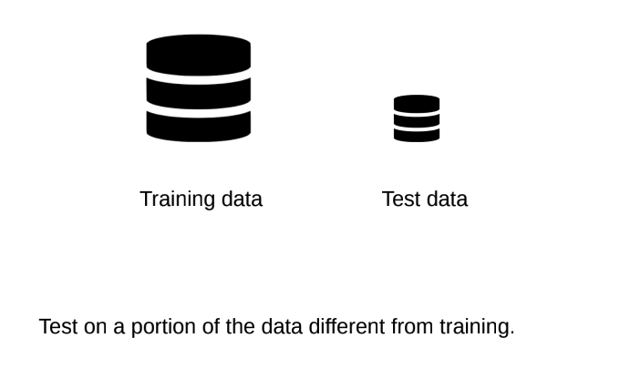
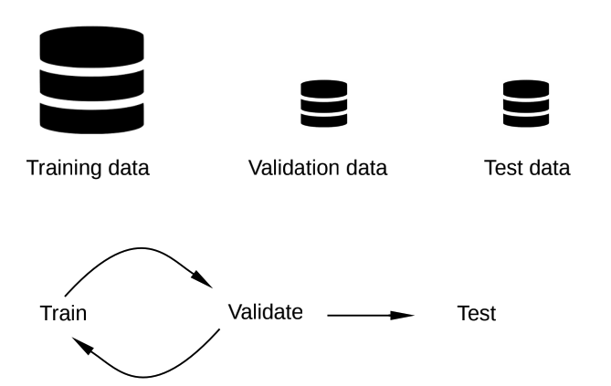
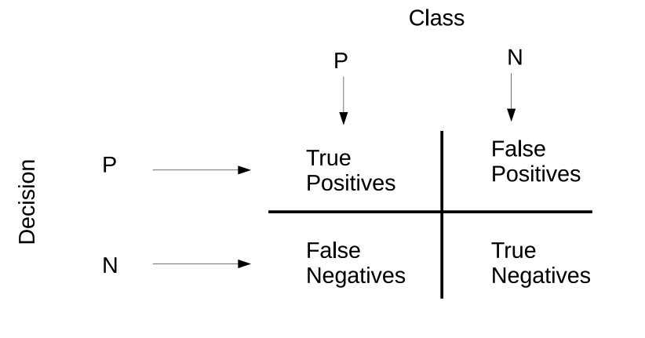
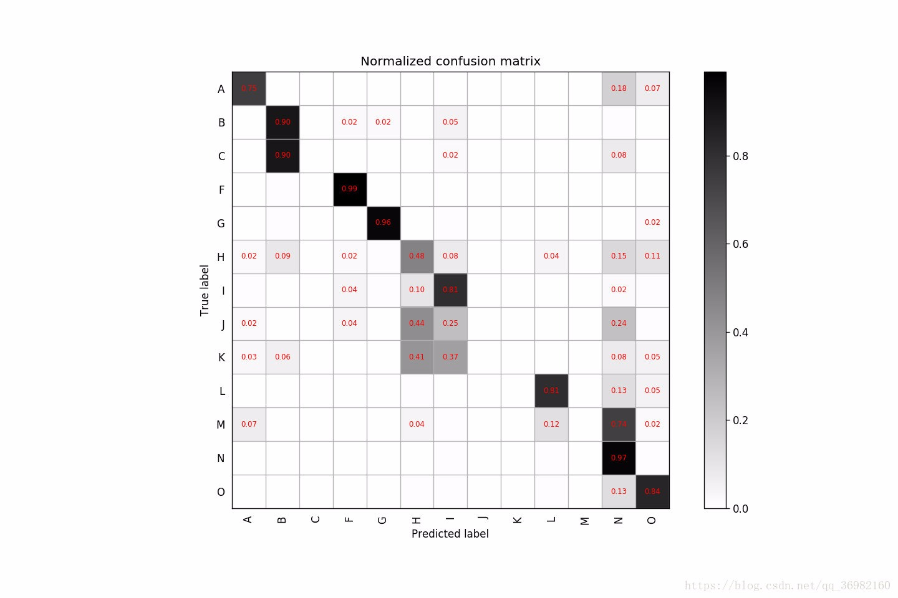
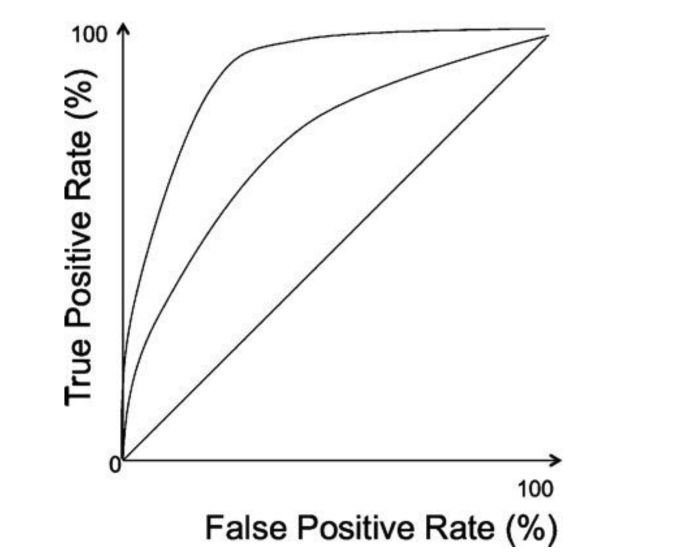

## Notes For -Week01-COMP5611M-Machine Learning Evaluation
@(Machine Learning)[Daolin Sheng, 04/10/2020, Instructor: Matteo Leonetti]
 @Reference files: [02-evaluation.pdf](https://minerva.leeds.ac.uk/bbcswebdav/pid-8154205-dt-content-rid-17517568_2/courses/202021_37210_COMP5611M/02-evaluation%281%29%281%29.pdf)  and  [02-evaluation-notes.pdf](https://minerva.leeds.ac.uk/bbcswebdav/pid-8154205-dt-content-rid-17517567_2/courses/202021_37210_COMP5611M/02-evaluation-notes%281%29%281%29.pdf)

--------------------

[TOC]

### Learning outcomes
- Define overfitting.
- Apply a strategy to avoid overfitting.
- List the main accuracy metrics to measure the performance of a classifier.
- Choose the appropriate metric for a given classification problem.
- Apply the metrics to real data sets and classifiers.

### Feature Selection
> The first step before any classification can take place is to decide what features we are considering when trying to discriminate two sets.
> For example, we could use width and height, or colour, shape…

### Overfitting
> A model overfits when it describes the randomness associated with the data, rather than the underlying relationship between the data points.
> 当模型描述与数据相关的随机性而不是数据点之间的潜在关系时，模型就过拟合。

### Occam's razor
> Attributed to William of Ockham (~1300 A.D.): Entities should not be multiplied unnecessarily

**Preventing Overfitting**

### Test set

### Validation set

**`Cross validation`**

### Measuring Accuracy
**Classification**
- Accuracy
- Precision
- Recall
- F1 score
- ROC Curve
- PR Curve
- AUC

**Regression**
- MAE
- MSE

#### Accuracy metrics

- 1, 正确率是我们最常见的评价指标，accuracy = （TP+TN）/(P+N)，这个很容易理解，就是被分对的样本数除以所有的样本数，通常来说，正确率越高，分类器越好；
$$ Accuracy    = \frac {TP + TN}{TP + TN + FP + FN} $$
 
- 2 错误率则与准确率相反，描述被分类器错分的比例，error rate = (FP+FN)/(TP+TN+FP+FN)，对某一个实例来说，分对与分错是互斥事件，所以accuracy =1 - error rate。
$$Error  = 1 - Accuracy $$

-----------
- 3, sensitive = TP/P，表示的是所有正例中被分对的比例，衡量了分类器对正例的识别能力。
$$ Sensitivity = \frac {TP}{TP+FN}$$

----------
- 4, specificity = TN/N，表示的是所有负例中被分对的比例，衡量了分类器对负例的识别能力。
$$ Specificity = \frac {TN}{FP+TN}$$

----------
- 5, 召回率是覆盖面的度量，度量有多个正例被分为正例，recall=TP/(TP+FN)=TP/P=sensitive，可以看到召回率与灵敏度是一样的。
$$ Recall        = \frac {TP}{TP+FN}$$

----------
- 6, 精度是精确性的度量，表示被分为正例的示例中实际为正例的比例，precision=TP/（TP+FP）；
$$ Precision   = \frac {TP}{TP+FP}$$

----------
- 7, 综合评价指标（F-Measure / Fb-score）是准确率和召回率的调和平均：Fb=[(1+b2)*P*R]/（b2*P+R），比较常用的是F1。

$$ F_\alpha = \frac {(\alpha ^2 + 1) P * R}{\alpha ^2 (P+R)}$$
当参数α=1时，就是最常见的F1，也即
$$ F_1            = \frac {2}{\frac{1}{precision} + \frac{1}{recall}}    0 \le F_1 \le 1 $$

----------
$$MCC           = \frac{TP \times TN - FP \times FN}{ \sqrt[2](TP+FP)(TP+FN)(TN+FP)(TN+FN)}   -1 \le MCC \le 1$$

#### Confusion Matrix

> A confusion matrix is a very convenient way to represent the accuracy of multi-class (non-binary) classifiers.
> Each entry at coordinate (x,y) in the matrix corresponds to the number of elements of class x classified as y.

#### ROC curve

> A convenient way to compare different models is the Receiver Operator Characteristic.
> The diagonal is a classifier that is just as good as picking the class at random. The perfect classifier would be in the top-left corner (0,100).
> Generate different points through cross-validation and connect them with a line. The classifier with the largest area (the more away from randomness) is the best one.

### Reading list
**MACHINE LEARNING An Algorithmic Perspective** Second Edition

notes:

