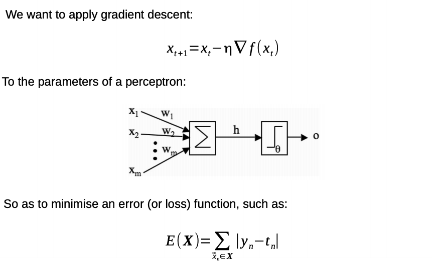
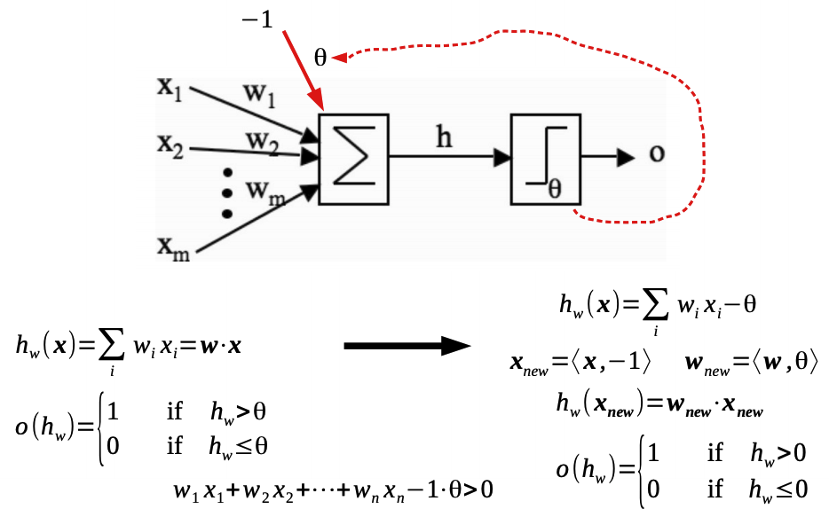
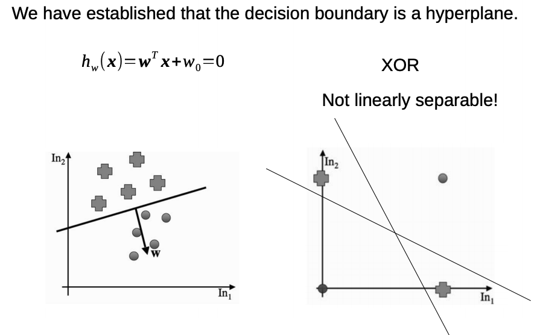
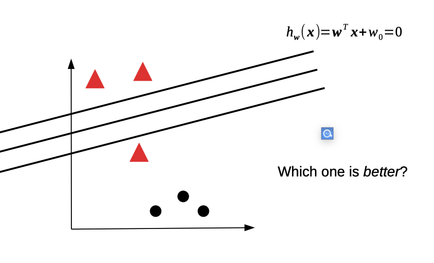
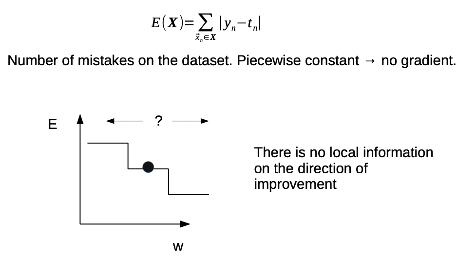

## Notes For -Week02-COMP5611M- Neural Networks: Perceptron 2

@(Machine Learning)[Daolin Sheng, 06/10/2020, Instructor: Matteo Leonetti]
 @Reference files: 
 [06-perceptron-part2.pdf](https://minerva.leeds.ac.uk/bbcswebdav/pid-8172100-dt-content-rid-17565364_2/courses/202021_37210_COMP5611M/06-perceptron-part2.pdf)  
[06-perceptron-part2-notes.pdf](https://minerva.leeds.ac.uk/bbcswebdav/pid-8172100-dt-content-rid-17565365_2/courses/202021_37210_COMP5611M/06-perceptron-part2-notes.pdf)

--------------------

[TOC]

### Learning outcomes
- Define linear separability.
- Justify whether a given error function is suitable for gradient descent.

### Recap

### Bias input

- We want to optimise the parameters of the perceptron through gradient descent.
- For this purpose, we will need to compute the derivative with respect to the parameters. With the weights this is simple (as we will see shortly). However, the threshold of the activation function is in an awkward position.
- Nonetheless, we can simply move the threshold on the other side of the inequality of the activation function, and treat it as it if were just a normal weight, associated with an additional input, called the bias input.
- The bias input must be fixed at a constant. The value of the constant is not important, since the parameter theta can adjust accordingly. In books, you will usually find either 1 or -1.

### Questions

### Solution

### Linear separability

-  The decision boundary of the perceptron is a hyperplane (in 2D, a straight line).
- The vector of weights (excluding the bias weight) is a vector orthogonal to the hyperplane, and plays an important role. 
- If the dataset is such that an hyperplane that separates the two classes exists, it is said to be linearly separable.
- The logic function XOR over points in {0,1}x{0,1} is a well-known example of a nonlinearly separable dataset.

### Number of mistakes as Error

- If we use the number of mistakes as an error function, all the lines drawn here will have the same error (since they all make the same number of mistakes).
- Therefore, it is not possible to use the number of mistakes to inform the search with a local optimization method. Most local steps achieve no difference in the objective (in our case the error) function, and it is impossible to know whether the algorithm is progressing towards a minimum or not.

### Number of mistakes

- Rather than this function, which is piecewise constant, we would like an error function in which the error decreases as the current solution gets closer to a misclassified point.
> 我们希望有一个误差函数，其中误差随着当前解越来越接近错误分类的点而减小，而不是分段恒定的函数。

### Conclusion

