## Notes For -Week02-COMP5611M- Neural Networks: Perceptron
@(Machine Learning)[Daolin Sheng, 06/10/2020, Instructor: Matteo Leonetti]
 @Reference files: 
 [04-perceptron-part1.pdf](https://minerva.leeds.ac.uk/bbcswebdav/pid-8172100-dt-content-rid-17563888_2/courses/202021_37210_COMP5611M/04-perceptron-part1%281%29.pdf)  
[04-perceptron-part1-notes.pdf](https://minerva.leeds.ac.uk/bbcswebdav/pid-8172100-dt-content-rid-17563889_2/courses/202021_37210_COMP5611M/04-perceptron-part1-notes%281%29.pdf)

--------------------

[TOC]

### Learning outcomes

- Describe the biological principles that inspired neural networks.
- Draw the diagram of the McCulloch and Pitts’s neuron.
- Distinguish between generative and discriminative learning models.
> 描述激发神经网络的生物学原理。
> 绘制McCulloch和Pitts的神经元图。
> 区分生成学习模型和判别学习模型。

### Demo
[Links](https://cs.stanford.edu/people/karpathy/convnetjs/)

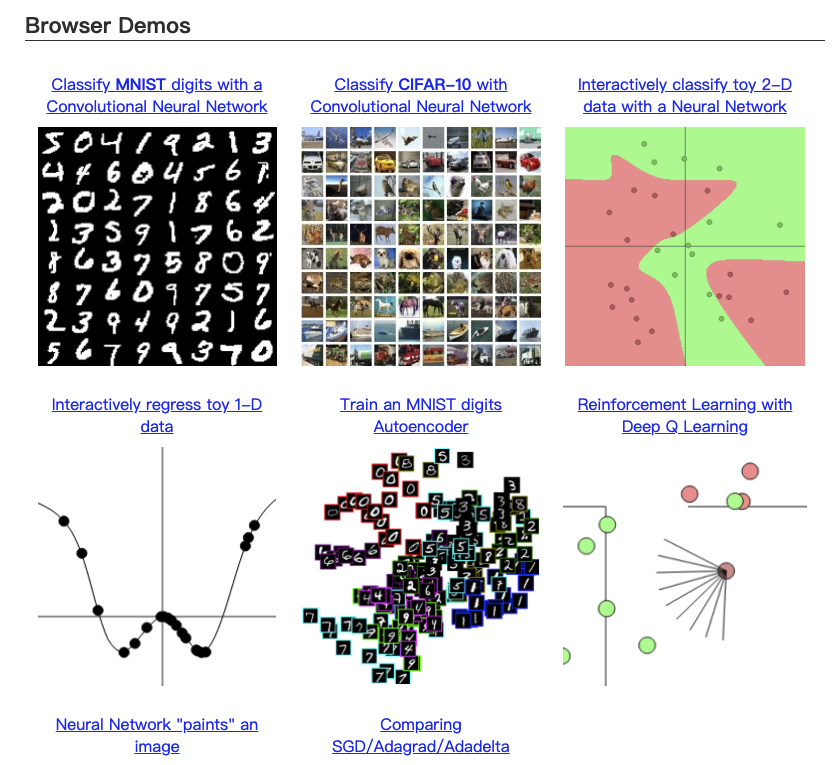

### About human Brain

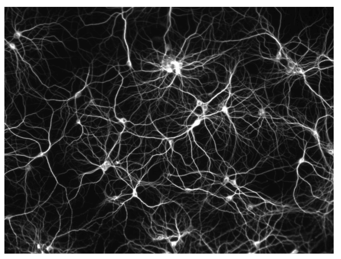

- Neural networks are models for classification and regression there were originally
inspired by the brain.
- Research on Neural Networks in computer science, however, has since significantly
diverged from neuroscience.

**Neurons**
10^11 neurons 10^15 synapses

### History

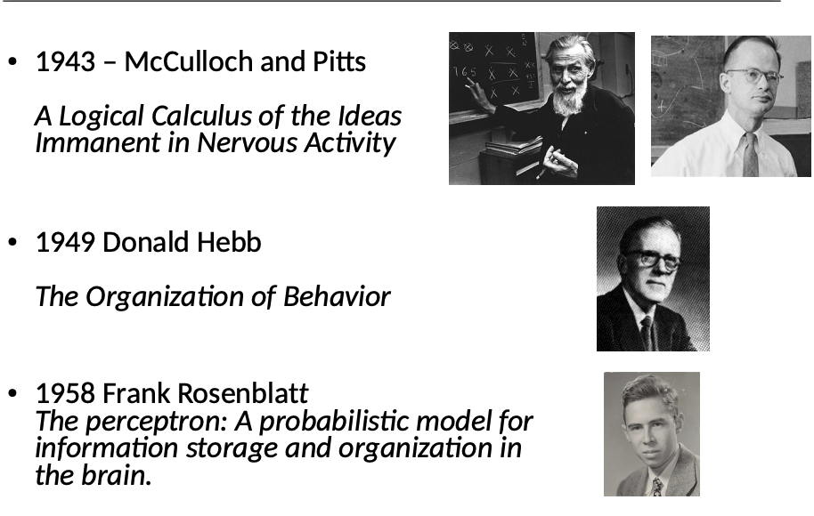
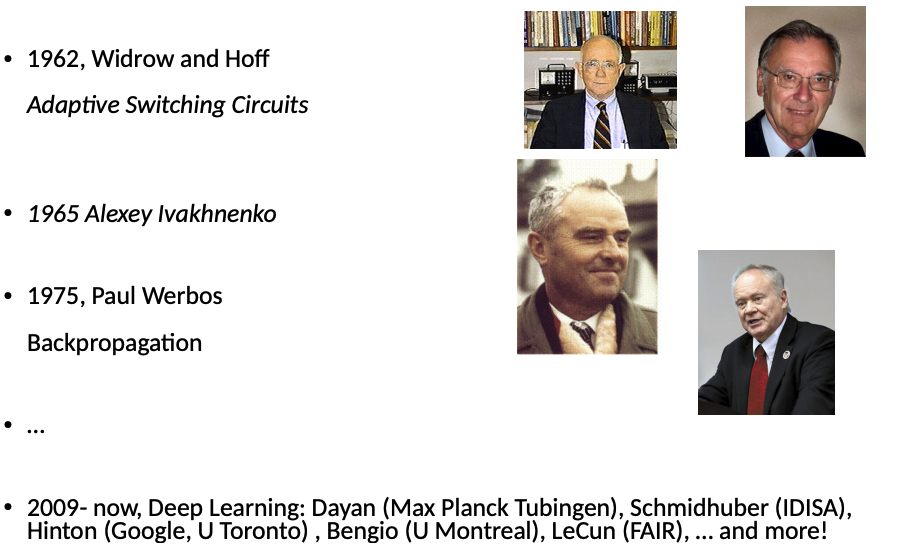

### Firing

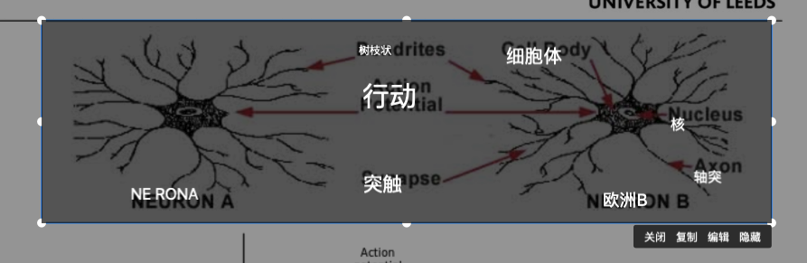

- Neurons are connected by dendrites.
- The fundamental mechanism that artificial neural networks imitate is the spike generated when the stimulus applied to a neuron overcomes a given threshold.

### Hebbian learning
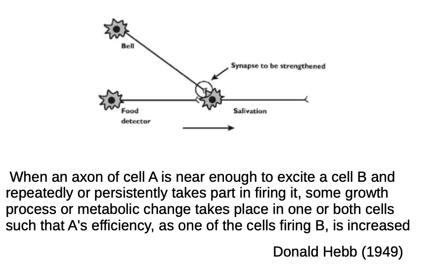
- Stimuli that repeatedly appear together cause the connections of the corresponding neurons to become stronger.
- This principle is behind Hebbian learning, and Pavlov’s “classical conditioning”.

### McCulloch and Pitts Neuron
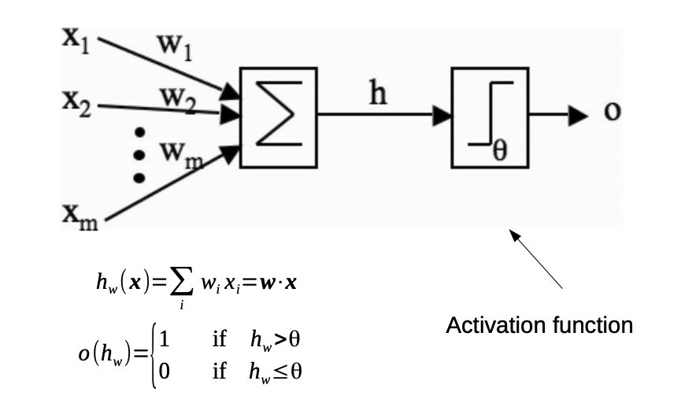
- The implementation of such principles in software takes the form of McCulloch and Pitts’s neuron.
- Each input is multiplied by a weight, and all the results are summed together.
- The sum is then fed to an activation function, which outputs 1 if the sum is above a
threshold, and 1 otherwise.

### Model Critique

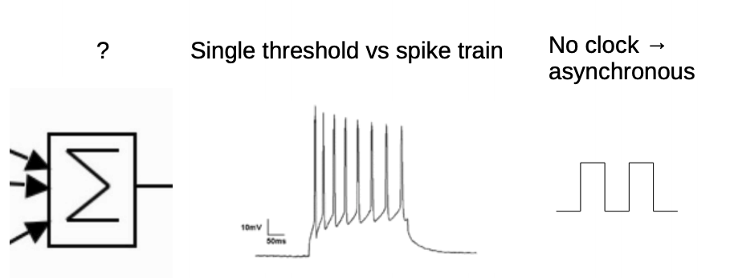

- Is this model realistic?
- It has not been established that what neurons compute is actually a sum.
The modelled neurons sends a single spike down the axon, while real neurons send trains of spikes, and the frequency encodes information.
- Real neural networks are asynchronous, while in our model all inputs must be present for a neuron to compute its output.

### A function approximator
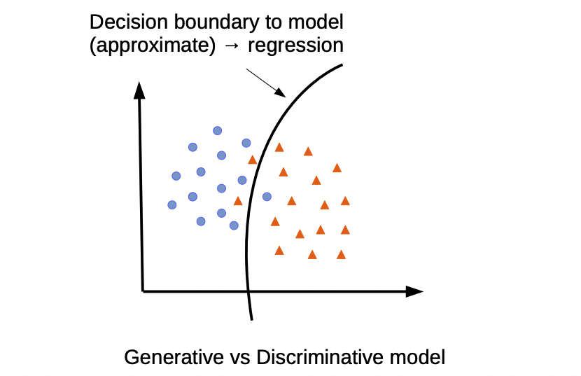
- We use neural networks to classify the input, which means learning a boundary function between the classes.
- A generative model can, as the name suggests, generate new data. Typically, generative models learn a distribution of the data, so that new data can be sampled from it (example: regression over the parameters of a certain distribution).
- A discriminative model learns the decision boundary between the classes, and cannot be used to generate new data points.
- Neural Networks (NNs) can be used both as a generative and a discriminative model. In this module, we will only study discriminative NNs.

### Perceptron
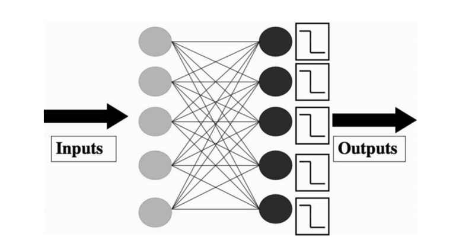

- A perceptron is a model with a number of independent neurons.
- Learning adjusts the weights of the neurons.
- Typically, there is one output neuron per class.

### Training the perceptron
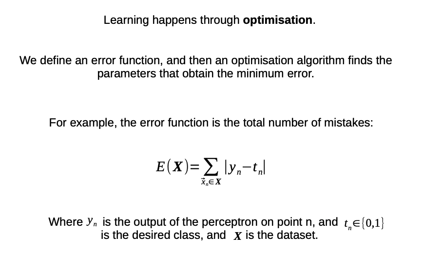

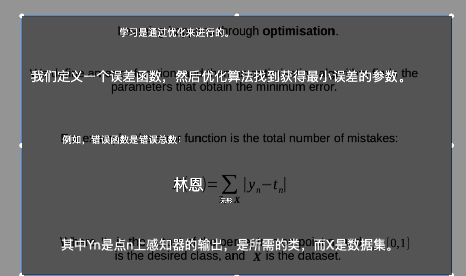

### Conclusion
- Local methods stop when the gradient is close to zero, which means that they are close to a stationary point.
- There is no guarantee that such a point is the global minimum. Local methods will, in general, converge to a local minimum of the objective function.
- A local minimum is a point such that all the points around it have a higher value of the objective function.

