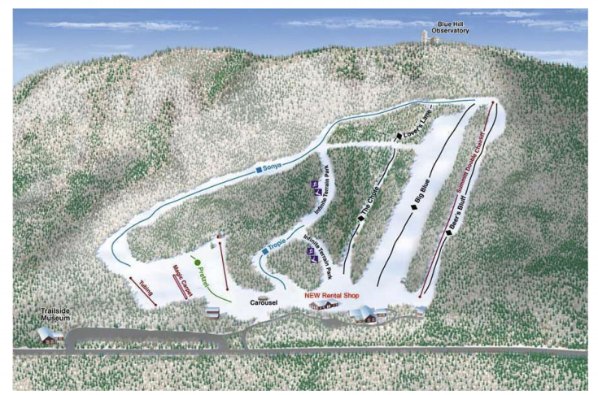
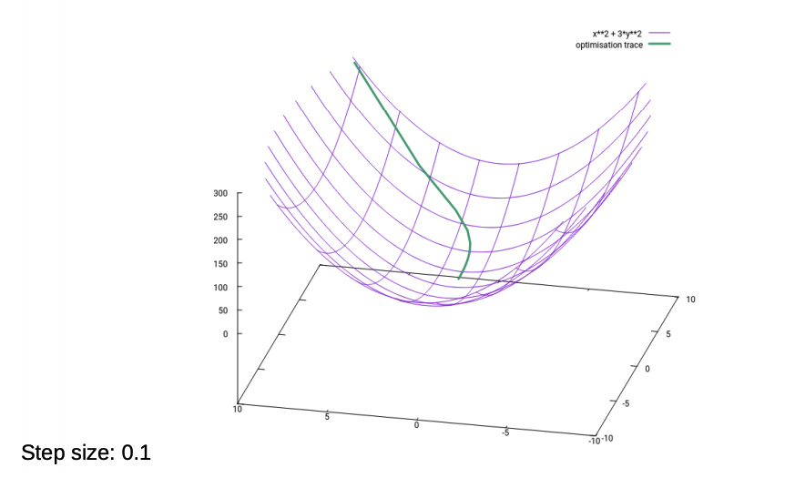
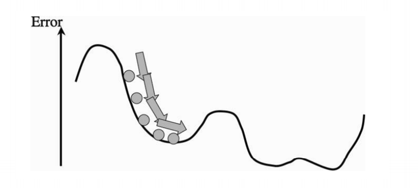

## Notes For -Week02-COMP5611M- Elements of Local Optimisation

@(Machine Learning)[Daolin Sheng, 06/10/2020, Instructor: Matteo Leonetti]
 @Reference files: 
 [05-opt.pdf](https://minerva.leeds.ac.uk/bbcswebdav/pid-8172100-dt-content-rid-17563886_2/courses/202021_37210_COMP5611M/05-opt%281%29.pdf)  
[05-opt-notes.pdf](https://minerva.leeds.ac.uk/bbcswebdav/pid-8172100-dt-content-rid-17563887_2/courses/202021_37210_COMP5611M/05-opt-notes%281%29.pdf)

--------------------

[TOC]

### Learning outcomes
- Describe the difference between zero, first, and secondorder optimisation methods.
- Apply gradient descent to a given objective function.
- Choose an appropriate step size for gradient descent.

### Goal

- Optimisation is the field that studies how to find the minimum (or maximum) of a function.
- Stationary points (minimum, maximum, and saddle points) have an important property: the derivative of the function in those points is always 0.

### Local Methods

- Local methods move from the current point along a given direction by a certain step, until a local minimum is found. Different methods determine the direction and the step differently.
- There are in general infinitely many directions, some will improve the current point (go down) others will make the current solution worse (of higher value, by going up).
- The best possible direction is the direction of steepest descent, which is the anti gradient (the gradient is the direction of steepest ascent).

### Gradient descent

### Question

### In 3D

- The step size determines how much the algorithm will move the point along the gradient. In first-order methods it is usually chosen as a small constant <= 0.1.
- A smaller step makes the algorithm slower, but a step that’s too large will make it bounce between solutions indefinitely, or even overshoot (example in next slide).

### Local Minima 局部最小值

- Local methods stop when the gradient is close to zero, which means that they are close to a stationary point.
- There is no guarantee that such a point is the global minimum. Local methods will, in
general, converge to a local minimum of the objective function.
- A local minimum is a point such that all the points around it have a higher value of the objective function.

### Conclusion

